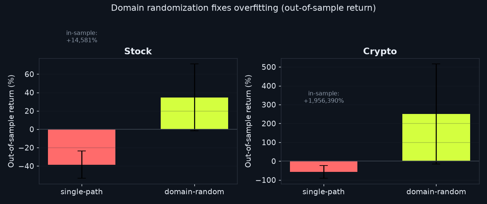
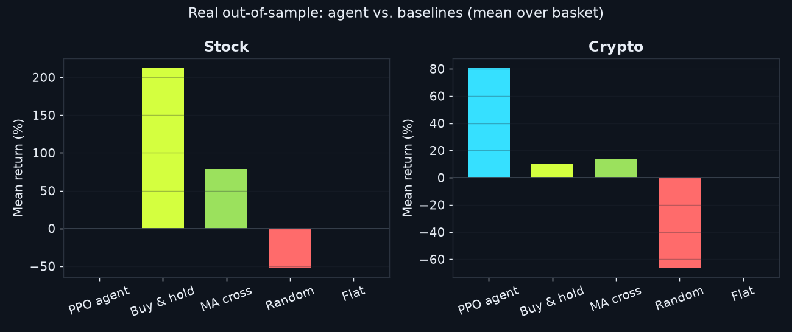

# RL-Trader — Reinforcement Learning for Stocks & Crypto

[](https://github.com/Danny-397/RL-for-Crypto-and-stocks-/actions/workflows/ci.yml)
[](https://www.python.org/)
[](https://pytorch.org/)
[](LICENSE)

A modular, research-grade framework for training **Proximal Policy Optimization (PPO)**
agents to trade financial markets. A single, unified agent architecture is trained
**separately** on two custom Gymnasium environments — one for **equities**, one for
**crypto** — so we can study how the *same* learning recipe adapts to two very
different market regimes.

> Built from scratch in PyTorch: the PPO algorithm, the trading environments, the
> data pipeline, and the evaluation suite are all implemented here — not wrapped from
> a high-level library. The goal is to *understand and own every layer of the stack.*

> **📊 [Read the full results & findings → `RESULTS.md`](RESULTS.md)** — an ablation
> that proves the overfitting fix, and a multi-seed significance study with an
> honest punchline. Short version: a *single* seed makes the crypto agent look like
> it beats the market (+80% vs. +10%) — but re-run across many seeds, that edge
> **evaporates** (mean −17%, CI straddling zero, indistinguishable from buy-&-hold).
> The project's own rigor tooling catches the false positive. **That discipline is
> the result**, not a fantasy return.

## Results at a glance

**The core finding — domain randomization fixes overfitting.** Trained on a single
price series, the agent *memorises* it (huge in-sample returns) and then loses
out-of-sample. Trained on randomized paths, it generalizes:



**A single backtest lies; a distribution tells the truth.** On one favorable seed
the crypto agent looks like it crushes buy-&-hold (+80% vs. +10%, winning 5 of 6
coins — this is the run the dashboard shows). But the honest test is to repeat the
whole walk-forward across many seeds:

| Market | Agent return (95% CI, 5 seeds) | vs. buy-&-hold | Verdict |
|---|---:|---:|---|
| Crypto | **−17%** `[−55%, +24%]` | +11% | indistinguishable (p ≈ 0.78) |
| Stock | **−13%** `[−26%, −2%]` | +212% | significantly **worse** (p ≈ 0.002) |

The crypto confidence interval straddles zero — the +80% run sits in the lucky
right tail, not the centre. **There is no reliable, seed-robust edge on real
markets**, exactly as weak-form market efficiency predicts. A naive project ships
the lucky backtest; `tools/real_significance.py` is what catches it.



---

## Why this project

Financial markets are a uniquely hard reinforcement-learning problem: the
environment is **non-stationary**, rewards are **noisy**, and naive agents overfit
to historical price paths. This framework is a disciplined attempt to do RL trading
*properly*:

- **Separation of concerns.** Data, environments, agent, training, and evaluation
  are independent, individually testable modules.
- **Leakage control.** Feature scalers are fit on the **training split only**; the
  data is split **chronologically** into train / validation / test.
- **Honest evaluation.** Agents are scored on a **held-out test set** with the
  metrics a quant actually cares about — total return, **annualised Sharpe**, and
  **maximum drawdown** — not on the data they trained on.
- **Risk-aware rewards.** Two selectable formulations: a return *net of*
  transaction costs, a drawdown penalty, and a turnover penalty; or the
  **Differential Sharpe Ratio** (Moody & Saffell, 1998), which optimises
  *risk-adjusted* return online. Both discourage reckless, over-leveraged,
  noise-trading behaviour.
- **Uncertainty quantification.** Headline claims ship with bootstrap confidence
  intervals across seeds and a paired permutation test against buy-&-hold (on
  *both* synthetic and real data), plus a rolling multi-fold walk-forward — so a
  result is a distribution, not an anecdote.
- **Stable, reproducible training.** A running observation normaliser (Welford,
  exported and applied at serve time) keeps inputs well-scaled, and full seeding of
  Torch + NumPy + the environment RNG makes a run **bit-for-bit reproducible** — the
  same seed reproduces the documented numbers.

---

## Architecture at a glance

```
                          ┌─────────────────────────────┐
                          │        Unified PPO Agent      │
                          │   (shared ActorCritic net)    │
                          │   policy head │ value head    │
                          └───────┬───────────────┬───────┘
            select_action(obs)    │               │   update(rollout)
                                  ▼               ▲
        ┌─────────────────────────────────────────────────────────┐
        │                     Rollout Buffer (GAE)                  │
        └─────────────────────────────────────────────────────────┘
                                  ▲               │
                          obs, reward             │ action
                                  │               ▼
        ┌───────────────────────┐     ┌───────────────────────┐
        │   StockTradingEnv     │     │   CryptoTradingEnv     │   ← BaseTradingEnv
        │  (low cost, ~252/yr)  │     │  (high cost, 365/yr)   │
        └───────────┬───────────┘     └───────────┬───────────┘
                    │                               │
        ┌───────────▼───────────────────────────────▼───────────┐
        │   Data pipeline: OHLCV → indicators → scale → split     │
        │   (synthetic GBM generator or your own CSVs)            │
        └─────────────────────────────────────────────────────────┘
```

**Observation** (per step): a rolling window of **19 engineered features**, grouped
by what they encode — multi-horizon momentum (1/5/20-bar + log returns),
trend/mean-reversion context (10/30/50 SMA ratios, EMA ratio), oscillators (RSI,
MACD + signal), band/range position (Bollinger %B, Donchian position), volatility
*level and regime* (10-bar vol, ATR, a 60-bar volatility z-score), and volume
microstructure (high–low range, volume change, volume z-score) — plus the agent's
own account state (position fraction, cash fraction, normalised equity). The regime
and band features give the policy the context a single price level can't convey.

**Action**: a single continuous value in `[-1, 1]` interpreted as the **target
position** as a fraction of equity (`+1` = fully long, `0` = flat, `-1` = fully
short). Targeting a position rather than emitting incremental buy/sell orders gives
the agent direct, stable control over its exposure and makes **position sizing**
an explicit, learnable decision.

---

## Project structure

```
rl_trader/
├── config/          # dataclass hyper-parameters + market presets
│   └── training_config.py
├── data/            # OHLCV loading, indicators, scaling, splits, synthetic data
│   └── data_loader.py
├── envs/            # Gymnasium environments
│   ├── base_env.py      # shared mechanics (accounting, costs, reward)
│   ├── stock_env.py
│   └── crypto_env.py
├── models/          # the agent and its networks
│   ├── networks.py      # shared-trunk ActorCritic + recurrent (LSTM) ActorCritic
│   └── ppo_agent.py     # PPO: clipped objective, GAE, save/load
├── training/        # rollout collection + PPO update loop + logging
│   ├── utils.py         # RolloutBuffer (GAE), feed-forward training engine, logger
│   ├── recurrent.py     # recurrent PPO: sequence buffer + truncated-BPTT update
│   ├── normalization.py # running (Welford) observation/reward normaliser
│   ├── train_stock.py
│   └── train_crypto.py
├── evaluation/      # backtesting metrics, statistics, plots
│   ├── evaluate_agent.py
│   ├── statistics.py    # bootstrap CIs + paired permutation tests
│   ├── walk_forward.py  # rolling multi-fold walk-forward splits + runner
│   └── plots.py
└── scripts/         # command-line entry points
    ├── run_stock_training.py
    ├── run_crypto_training.py
    └── compare_markets.py
tests/               # pytest suite (envs, agent, features, reward, recurrent, stats)
tools/
├── fetch_data.py        # download a real OHLCV basket (Yahoo Finance)
├── build_site_data.py   # train + backtest -> docs/results.js for the dashboard
├── ablation.py          # domain-randomization overfitting study
├── baseline_report.py   # agent vs. buy-&-hold / random / momentum
├── significance.py      # multi-seed CIs + permutation test (synthetic)
├── real_significance.py # multi-seed CIs + permutation test on the real basket
└── make_figures.py      # render docs/assets/*.png for the README & report
docs/                # data-driven web dashboard + figures (GitHub Pages ready)
```

---

## Quick start

```bash
# 1. Install
python -m venv .venv && source .venv/bin/activate    # Windows: .venv\Scripts\activate
pip install -r requirements.txt
pip install -e .                                      # optional: editable install

# 2. Train (uses a built-in synthetic data generator — no downloads needed)
python -m rl_trader.scripts.run_stock_training  --timesteps 50000
python -m rl_trader.scripts.run_crypto_training --timesteps 50000

# 3. Run the headline experiment: same agent, both markets, side-by-side
python -m rl_trader.scripts.compare_markets --timesteps 40000 --plot

# 4. Run the tests
pytest -q
```

### Using your own data

Drop an OHLCV CSV (`open,high,low,close,volume`, optionally `date`) anywhere and
point a trainer at it:

```bash
python -m rl_trader.scripts.run_stock_training  --data data/raw/AAPL.csv
python -m rl_trader.scripts.run_crypto_training --data data/raw/BTC-USD.csv
```

Or fetch the whole default basket (10 stocks + 6 crypto pairs) in one command:

```bash
pip install yfinance
python tools/fetch_data.py        # -> data/raw/{stock,crypto}/*.csv  (cached, with backoff)
python tools/build_site_data.py --real --timesteps 200000   # real walk-forward dashboard
```

`--real` trains each agent on a basket of real tickers (domain-randomized across
names) and backtests on every ticker's **held-out recent period** — a multi-asset
walk-forward evaluation. The bundled dashboard is generated exactly this way.

---

## Research-style write-up

**Hypothesis.** A single PPO recipe will learn *qualitatively different* policies
on stocks versus crypto, because the two markets differ in volatility, tail risk,
and trading frictions. We expect the crypto agent to favour smaller, more defensive
position sizes (higher costs, deeper drawdowns) relative to the stock agent.

**Method.** Hold the agent architecture and PPO hyper-parameters fixed. Train one
agent per market on that market's **training split**, using market-specific
environment dynamics (`stock_config` vs `crypto_config`: cost, slippage, drawdown
penalty, exploration). Select on the **validation split** during training.

**Measurement.** Backtest each trained agent on its untouched **test split** and
report:

| Metric | What it tells us |
| --- | --- |
| **Total return** | Did the strategy make money out-of-sample? |
| **Annualised Sharpe** | Return *per unit of risk* — the real quality signal |
| **Max drawdown** | Worst peak-to-trough loss — the pain a trader would feel |
| **Action distribution** | *How* the agent traded — its learned sizing behaviour |

`scripts/compare_markets.py` prints these side by side and (with `--plot`) saves
equity curves, so the difference in learned behaviour is visible, not just asserted.

**Overfitting control — domain randomization.** A single price path is trivial
to memorise: an agent trained on one sequence reaches huge in-sample equity and
then *loses* out-of-sample. To force a *generalizable* policy, training draws a
**fresh synthetic path every episode** (`train_series_factory`), while
validation and test stay on fixed held-out paths. This single change moved the
crypto agent from catastrophic overfitting to a positive, risk-controlled
out-of-sample backtest. The effect is quantified by an **ablation study**
(`python tools/ablation.py`), which trains agents with and without the technique
and reports the in-sample vs. out-of-sample gap directly.

**Honest baselines.** The agent is benchmarked not only against buy-&-hold but
also against *random* and *moving-average-crossover* strategies
(`rl_trader/evaluation/baselines.py`), all run through the identical
cost-and-slippage environment — so any edge has to be real.

> **Note on results.** The [web dashboard](#web-prototype) and
> [`RESULTS.md`](RESULTS.md) report **real, out-of-sample backtests** — no mock
> numbers, and no hiding the unflattering parts. The dashboard shows one favorable
> seed; the multi-seed significance study then shows that edge does **not** survive
> resampling. Reporting that — rather than the lucky backtest — is the point.

---

## Design decisions worth highlighting

- **Unified agent, separate environments.** The `PPOAgent` speaks only in
  observation/action tensors and is completely market-agnostic — the exact design
  the comparison experiment requires.
- **Shared `BaseTradingEnv`.** All accounting, cost, and reward logic lives in one
  place, so the stock and crypto envs cannot silently diverge.
- **From-scratch PPO** with the stabilisers that matter in practice: GAE,
  advantage normalisation, clipped value loss, entropy bonus, orthogonal init,
  gradient clipping, and a running observation normaliser.
- **Two policy families, one training contract.** A feed-forward shared-trunk
  `ActorCritic` and a fully-implemented **recurrent (LSTM) actor-critic** train
  through the same PPO machinery — the recurrent variant adds hidden-state
  continuity during rollout collection and replays whole sequences (truncated BPTT)
  during the update. Flip `PPOConfig.use_lstm` to switch.
- **Extensible by construction.** Add a market by subclassing `BaseTradingEnv`;
  add an algorithm (DDPG/SAC) alongside `PPOAgent` with the same
  `select_action`/`update` API.

---

## Extending the framework

| Want to… | Do this |
| --- | --- |
| Add a new market (e.g. FX) | Subclass `BaseTradingEnv`, register it in `envs/__init__.make_env` |
| Add a new algorithm | Implement alongside `PPOAgent` with the same `select_action`/`update` API |
| Use sequence models | Set `PPOConfig.use_lstm = True` — the recurrent PPO loop is built in |
| Optimise risk-adjusted return | Set `RewardConfig.kind = "dsr"` (Differential Sharpe Ratio) |
| Change the reward | Edit `RewardConfig` weights or `BaseTradingEnv._compute_reward` |
| Test significance | `tools/significance.py` (CIs + permutation) or `evaluation/walk_forward.py` |
| Tune training | Edit the dataclasses in `config/training_config.py` or pass CLI flags |

---

## Web prototype

A self-contained landing page lives in [`docs/`](docs/) (dark cyber-fintech
theme). Crucially, it is **data-driven**: an interactive dashboard renders
*real* backtest output — agent-vs-benchmark equity curves, a drawdown chart, an
action-distribution histogram, and a metric scorecard you can toggle between
stock and crypto.

```bash
python tools/build_site_data.py --timesteps 200000   # regenerates docs/results.js from a real run
```

That script trains both agents, backtests them on held-out data, and writes the
results the page loads — so the site never shows mock numbers. Open
`docs/index.html` locally, or enable **GitHub Pages → Deploy from branch →
`main` / `docs`** to publish it at
`https://danny-397.github.io/RL-for-Crypto-and-stocks-/`.

## Deploy (Render + Vercel)

Production deployment is two independent pieces — see **[DEPLOY.md](DEPLOY.md)**
for the click-by-click guide:

- **Frontend → Vercel** (static `docs/`, zero build). Works standalone on its
  baked data.
- **Backend → Render** (`server/`) — an optional, featherweight **live-inference
  API**. The trained policy is exported to a tiny NumPy archive
  (`tools/export_policy.py`) and served with plain matmuls, so the container
  needs **no PyTorch or ONNX** and cold-starts fast on the free tier. A
  [`render.yaml`](render.yaml) Blueprint makes it one-click.

Set `window.RL_API` in `docs/config.js` to the Render URL and the dashboard's
"Run live" widget lights up — pulling real prices and running the agent on
demand. Leave it empty and the site is fully static.

## License

MIT — see [LICENSE](LICENSE).
