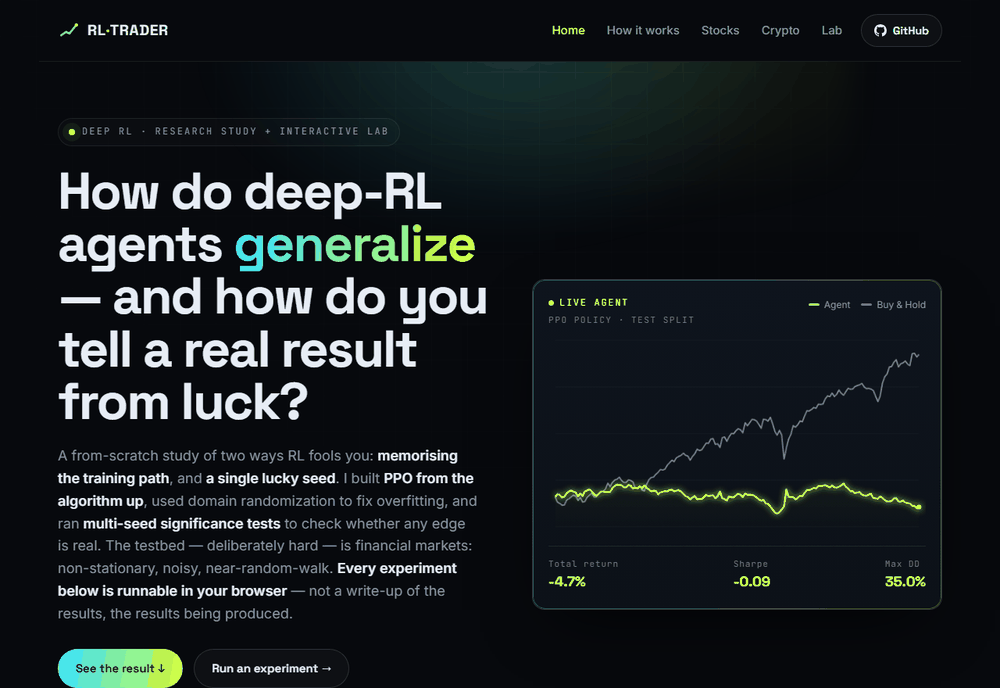

# RL-Trader — Generalization & Evaluation Rigor in Deep Reinforcement Learning

*An empirical study of how deep-RL agents overfit, generalize, and get honestly
measured — with financial markets as a hard, non-stationary testbed.*

[](https://github.com/Danny-397/RL-for-Crypto-and-stocks-/actions/workflows/ci.yml)
[](https://github.com/Danny-397/RL-for-Crypto-and-stocks-/actions/workflows/smoke.yml)
[](https://www.python.org/)
[](https://pytorch.org/)
[](LICENSE)

### 🔗 Interactive research lab → **[rl-for-crypto-and-stocks.vercel.app](https://rl-for-crypto-and-stocks.vercel.app/)**

Not a write-up of the experiments — the experiments themselves, runnable in the
browser. Configure an environment and run a real episode, scrub to any bar and read
the exact 563-dimensional observation the agent consumed, replay that bar under
different actions, push the agent onto distributions it never trained on, and
re-run the paper's own statistics with your own parameters. Every experiment gets
an id and a reproducibility receipt, and any of them can be replayed.

[](https://rl-for-crypto-and-stocks.vercel.app/#lab)

<sub>Recorded by `tools/make_demo.py`, which drives the real page in headless
Chromium against a running backend. Every figure in it was computed during the
capture — including the frame where the agent is beaten by all four naive
baselines.</sub>

## Abstract

Deep reinforcement learning is notoriously easy to *fool yourself* with: agents
memorise their training trajectory, and a single lucky random seed can look like a
real result. This project is a from-scratch study of both failure modes, using
financial markets as a deliberately hard environment — **non-stationary, partially
observable, with a noisy reward and near-random-walk signal**. I implement
**Proximal Policy Optimization (PPO)** from the algorithm up in PyTorch and train one
unified agent on two custom Gymnasium environments (equities and crypto) to ask three
research questions: **(1)** does the same learning recipe generalize across two
market regimes; **(2)** how badly does an RL agent overfit a single price trajectory,
and does **domain randomization** fix it; and **(3)** does an apparent out-of-sample
edge survive **multi-seed significance testing**? The headline result is negative and
that is the point: on real markets the agent has **no seed-robust edge over
buy-and-hold**, and the framework's own significance tooling is what caught it: an
earlier build of this study published the crypto agent at +275% (commit `d4c0ef9`),
and that run survived neither reseeding nor a two-month extension of the evaluation
window. In doing so the project independently reproduces, in
a new domain, the central methodological finding of Henderson et al. (2018), *Deep
Reinforcement Learning that Matters* — that single-run RL evaluations are unreliable —
and quantifies the memorization-vs-generalization gap that domain randomization closes
by **two-to-three orders of magnitude**.

> **Built from scratch in PyTorch:** the PPO algorithm, both environments, the data
> pipeline, and the entire evaluation suite are implemented here — not wrapped from a
> high-level library — because owning every layer is what let me instrument and trust
> the experiments. **📄 [Paper (arXiv-style) → `paper/`](paper/) · 📊 [Full methodology & results → `RESULTS.md`](RESULTS.md).**

## Research questions

| # | Question | Where it's answered |
|---|---|---|
| **RQ1** | Does one fixed PPO recipe learn *qualitatively different* policies across two market regimes (equities vs. crypto)? | [`compare_markets.py`](rl_trader/scripts/compare_markets.py), [RESULTS §3](RESULTS.md) |
| **RQ2** | How severely does an RL agent overfit a single price trajectory, and does **domain randomization** restore generalization? | [`tools/ablation.py`](tools/ablation.py), [RESULTS §1](RESULTS.md) |
| **RQ3** | Does an apparent out-of-sample edge survive **multi-seed** resampling and a permutation test — or is it seed luck? | [`tools/real_significance.py`](tools/real_significance.py), [RESULTS §5](RESULTS.md) |
| **RQ4** | Do the same conclusions hold on the harder problem of **cross-sectional allocation** (long/short weights over a basket)? | [`tools/portfolio_experiment.py`](tools/portfolio_experiment.py), [RESULTS §6](RESULTS.md) |

**Findings in one line:** the recipe transfers across regimes (RQ1); a single-path
agent memorises catastrophically and domain randomization closes the gap by 100–1000×
(RQ2); and no apparent real-market edge survives multi-seed testing (RQ3, RQ4) —
consistent with weak-form market efficiency, and a clean live demonstration of *why
you never trust a single RL run.*

## Results at a glance

**The core finding — domain randomization fixes overfitting.** Trained on a single
price series, the agent *memorises* it (huge in-sample returns) and then loses
out-of-sample. Trained on randomized paths, it generalizes:


**Measured like a researcher — across seeds, not one lucky run.** An earlier build
of this study published the crypto agent at +275% against buy-&-hold's +19% (commit
`d4c0ef9`), winning 4 of 6 coins. The professional move is not to ship that but to
repeat the whole walk-forward across many seeds and put a confidence interval and a
significance test on it:

<!-- BEGIN GENERATED: significance-brief -->
| Market | Agent return (95% CI, seeds) | Buy & hold | Verdict |
|---|---:|---:|---|
| Crypto | **+79.7%** `[+1%, +163%]` | +33% | indistinguishable (p = 0.82) |
| Stock | **−21.5%** `[−29%, −15%]` | +240% | significantly **worse** (p = 0.0021) |
<!-- END GENERATED: significance-brief -->

Read the spread, not the mean. The individual seeds returned:

<!-- BEGIN GENERATED: seed-spread -->
- **Stock** — −20.9%, −23.6%, −12.2%, −14.5%, −36.5%
- **Crypto** — +225.5%, +135.0%, −3.4%, −28.8%, +70.1%
<!-- END GENERATED: seed-spread -->

One crypto seed more than tripled capital while another lost money, on identical
code and identical data. The crypto mean is positive, but the paired test against
buy-&-hold across the held-out pairs cannot tell the two apart, and on equities the
agent is significantly *worse* than simply holding. **There is no reliable,
seed-robust edge on real markets**, as weak-form market efficiency predicts. A naive
project ships the lucky backtest; `tools/real_significance.py` is what catches it.

**"Maybe PPO is just the wrong tool."** That is the obvious objection to a negative
result, and the rule-based baselines cannot answer it. So two ordinary supervised
models — ridge regression on the next bar's return, logistic regression on its
direction, both written from scratch in NumPy — were fit on the *same* features and
*same* training split and traded through the *same* environment at the *same* costs:

<!-- BEGIN GENERATED: supervised-brief -->
| Market | Ridge | Logistic | PPO agent | Buy & hold |
|---|---:|---:|---:|---:|
| Stocks | −6.0% | +3.1% | −4.7% | **+239.3%** |
| Crypto | +0.7% | −7.4% | +38.7% | **+33.2%** |
<!-- END GENERATED: supervised-brief -->

Neither beat buy-and-hold in either market, so two unrelated method classes land in
the same place. Their in-sample directional accuracy was *above* chance, so they did
fit their training data — and none of it survived out of sample. That is the
overfitting result again, reached by a completely different route.
(`tools/supervised_report.py`)


**It also does the harder problem: cross-sectional allocation.** The same PPO agent
runs as a **portfolio allocator** — observing a whole basket and choosing long/short
weights across it under a gross-exposure budget (`tools/portfolio_experiment.py`),
benchmarked against equal-weight and a cross-sectional-momentum factor through the
identical cost model. Building and fairly evaluating that is the contribution; on
real daily data it lands in the same place as the single-asset agent — diversified
benchmarks are hard to beat, measured honestly.

---

## Why markets are the testbed

The research questions above — generalization, memorization, and honest evaluation —
are *general* problems in deep RL. Financial markets just happen to be an unusually
punishing place to study them: the environment is **non-stationary** (the data-
generating process drifts), **partially observable** (price alone hides the state),
the reward is **noisy** and near-zero-signal (weak-form efficiency; Fama 1970), and a
single historical path is *trivial* to memorise. That combination makes every RL
pathology show up loudly and quickly, which is exactly what you want from a testbed.
This framework is a disciplined attempt to study them *properly*:

- **Separation of concerns.** Data, environments, agent, training, and evaluation
  are independent, individually testable modules.
- **Leakage control.** Feature scalers are fit on the **training split only**; the
  data is split **chronologically** into train / validation / test.
- **Honest evaluation.** Agents are scored on a **held-out test set** with the
  metrics a quant actually cares about — total return, **annualised Sharpe**, and
  **maximum drawdown** — not on the data they trained on.
- **Risk-aware rewards.** Two selectable formulations: a return *net of*
  transaction costs, a drawdown penalty, and a turnover penalty; or the
  **Differential Sharpe Ratio** (Moody & Saffell, 1998), which optimises
  *risk-adjusted* return online. Both discourage reckless, over-leveraged,
  noise-trading behaviour.
- **Uncertainty quantification.** Headline claims ship with bootstrap confidence
  intervals across seeds and a paired permutation test against buy-&-hold (on
  *both* synthetic and real data), plus a rolling multi-fold walk-forward — so a
  result is a distribution, not an anecdote.
- **Stable, reproducible training.** A running observation normaliser (Welford,
  exported and applied at serve time) keeps inputs well-scaled, and full seeding of
  Torch + NumPy + the environment RNG makes a run **bit-for-bit reproducible** — the
  same seed reproduces the documented numbers.

---

## Where this sits in the RL literature

This project isn't inventing new algorithms — it's a careful reproduction and
cross-domain stress-test of results the field already considers important, which is
itself a research skill. The experiments are designed as concrete instances of:

- **Evaluation rigor / the reproducibility crisis in deep RL.** Henderson et al.,
  *Deep Reinforcement Learning that Matters* (AAAI 2018), showed that deep-RL results
  swing wildly across random seeds and that single-run numbers are unreliable. RQ3
  reproduces exactly this in a financial domain: an earlier published +275%
  single-seed run did not survive reseeding — across 5 seeds the individual
  returns span more than an order of magnitude, and the agent is not
  distinguishable from buy-and-hold.
  *(See [RESULTS §5](RESULTS.md).)*
- **Generalization & overfitting in RL.** Training and testing on the same instance
  overstates performance (Cobbe et al., *Quantifying Generalization in RL*, ICML 2019).
  **Domain randomization** — the sim-to-real technique of Tobin et al. (IROS 2017) —
  is my fix: a fresh synthetic price path each episode. RQ2 measures the memorization
  gap it closes directly. *(See [RESULTS §1](RESULTS.md).)*
- **The algorithm.** PPO (Schulman et al., 2017) with Generalized Advantage
  Estimation (Schulman et al., 2016), implemented from scratch — clipped objective,
  GAE, entropy bonus, orthogonal init, gradient clipping, and a Welford (1962) running
  observation normaliser.
- **RL for trading, specifically.** The **Differential Sharpe Ratio** reward comes
  from Moody & Saffell's direct-reinforcement trading work (1998/2001); the honest
  conclusion — no reliable edge from price alone — is what weak-form market efficiency
  (Fama, 1970) predicts, and reproducing *that* cleanly is a feature, not a
  disappointment.

<details>
<summary><b>References</b></summary>

- Schulman, Wolski, Dhariwal, Radford, Klimov (2017). *Proximal Policy Optimization Algorithms.* arXiv:1707.06347.
- Schulman, Moritz, Levine, Jordan, Abbeel (2016). *High-Dimensional Continuous Control Using Generalized Advantage Estimation.* arXiv:1506.02438.
- Henderson, Islam, Bachman, Pineau, Precup, Meger (2018). *Deep Reinforcement Learning that Matters.* AAAI.
- Tobin, Fong, Ray, Schneider, Zaremba, Abbeel (2017). *Domain Randomization for Transferring Deep Neural Networks from Simulation to the Real World.* IROS.
- Cobbe, Klimov, Hesse, Kim, Schulman (2019). *Quantifying Generalization in Reinforcement Learning.* ICML.
- Moody, Wu, Liao, Saffell (1998); Moody & Saffell (2001). *Learning to Trade via Direct Reinforcement.* IEEE Transactions on Neural Networks.
- Fama (1970). *Efficient Capital Markets: A Review of Theory and Empirical Work.* Journal of Finance.
- Welford (1962). *Note on a Method for Calculating Corrected Sums of Squares and Products.* Technometrics.

</details>

---

## Architecture at a glance

```
                          ┌─────────────────────────────┐
                          │        Unified PPO Agent      │
                          │   (shared ActorCritic net)    │
                          │   policy head │ value head    │
                          └───────┬───────────────┬───────┘
            select_action(obs)    │               │   update(rollout)
                                  ▼               ▲
        ┌─────────────────────────────────────────────────────────┐
        │                     Rollout Buffer (GAE)                  │
        └─────────────────────────────────────────────────────────┘
                                  ▲               │
                          obs, reward             │ action
                                  │               ▼
        ┌───────────────────────┐     ┌───────────────────────┐
        │   StockTradingEnv     │     │   CryptoTradingEnv     │   ← BaseTradingEnv
        │  (low cost, ~252/yr)  │     │  (high cost, 365/yr)   │
        └───────────┬───────────┘     └───────────┬───────────┘
                    │                               │
        ┌───────────▼───────────────────────────────▼───────────┐
        │   Data pipeline: OHLCV → indicators → scale → split     │
        │   (synthetic GBM generator or your own CSVs)            │
        └─────────────────────────────────────────────────────────┘
```

**Observation** (per step): a rolling window of **28 engineered features**, grouped
by what they encode — multi-horizon momentum (1/5/20/60/120-bar + log returns),
trend/mean-reversion context (10/30/50/100 SMA ratios, EMA ratio), oscillators (RSI,
MACD + signal), band/range position (Bollinger %B, Donchian position), volatility
*level and regime* (10-bar vol, ATR, a 60-bar volatility z-score, short/long vol
ratio), and a risk-regime signal (distance below the trailing 6-month high), plus
volume microstructure (high–low range, volume change, volume z-score), and
**cross-asset market context** — the asset's *relative strength* vs. the market
index (SPY for stocks, BTC for crypto) and the market's own trend/momentum — and the
agent's own account state (position fraction, cash fraction, normalised equity). The
relative-strength and market-regime features feed the policy genuinely *exogenous*
information a single ticker's OHLCV can't convey.

**Action**: a single continuous value in `[-1, 1]` interpreted as the **target
position** as a fraction of equity (`+1` = fully long, `0` = flat, `-1` = fully
short). Targeting a position rather than emitting incremental buy/sell orders gives
the agent direct, stable control over its exposure and makes **position sizing**
an explicit, learnable decision.

**Cross-sectional mode** (`PortfolioTradingEnv`): the same PPO agent generalises
from one asset to a **basket** — it observes every asset's features at once and
emits an *N*-dimensional **weight vector** (long the strong, short the weak), under
a gross-exposure budget. This is the harder, more realistic problem of *allocation*
rather than single-name timing; run it with `tools/portfolio_experiment.py`.

---

## Project structure

```
rl_trader/
├── config/          # dataclass hyper-parameters + market presets
│   └── training_config.py
├── data/            # OHLCV loading, indicators, scaling, splits, synthetic data
│   ├── data_loader.py     # single-asset pipeline
│   └── portfolio_data.py  # multi-asset, date-aligned basket pipeline
├── envs/            # Gymnasium environments
│   ├── base_env.py      # shared mechanics (accounting, costs, reward)
│   ├── stock_env.py
│   ├── crypto_env.py
│   └── portfolio_env.py # cross-sectional, N-asset weight-allocation env
├── models/          # the agent and its networks
│   ├── networks.py      # shared-trunk ActorCritic + recurrent (LSTM) ActorCritic
│   └── ppo_agent.py     # PPO: clipped objective, GAE, save/load
├── training/        # rollout collection + PPO update loop + logging
│   ├── utils.py         # RolloutBuffer (GAE), feed-forward training engine, logger
│   ├── recurrent.py     # recurrent PPO: sequence buffer + truncated-BPTT update
│   ├── portfolio.py     # cross-sectional portfolio training loop
│   ├── normalization.py # running (Welford) observation/reward normaliser
│   ├── train_stock.py
│   └── train_crypto.py
├── evaluation/      # backtesting metrics, statistics, plots
│   ├── evaluate_agent.py
│   ├── statistics.py    # bootstrap CIs + paired permutation tests
│   ├── walk_forward.py  # rolling multi-fold walk-forward splits + runner
│   ├── portfolio_eval.py # portfolio backtest + cross-sectional baselines
│   └── plots.py
└── scripts/         # command-line entry points
    ├── run_stock_training.py
    ├── run_crypto_training.py
    └── compare_markets.py
server/              # the experiment engine behind the lab (torch-free)
├── app.py               # Flask routes: dashboard + lab endpoints
├── lab.py               # config parsing, env construction, experiment runners
├── experiments.py       # async experiment registry, progress, receipts
├── policy.py            # actor(-critic) forward pass in plain NumPy
├── rollout.py           # full per-bar traces + state-restoring counterfactuals
├── regimes.py           # controlled synthetic distributions for shift testing
├── precomputed.py       # the repo's real committed results, with provenance
├── stats_api.py         # live bootstrap / permutation inference
└── models/              # exported policy archives (ppo_*.npz)
tests/               # pytest suite (envs, agent, features, reward, recurrent, stats,
                     #   normalization, portfolio, snapshot, lab backend, HTTP API)
tools/
├── fetch_data.py        # download a real OHLCV basket; --end pins a snapshot
├── smoke_lab.py         # 77 headless-browser checks against the live lab
├── build_site_data.py   # train + backtest -> docs/results.js for the dashboard
├── ablation.py          # domain-randomization overfitting study
├── baseline_report.py   # agent vs. buy-&-hold / random / momentum
├── significance.py      # multi-seed CIs + permutation test (synthetic)
├── real_significance.py # multi-seed CIs + permutation test on the real basket
├── surrogate_test.py    # surrogate-data falsification test (signal vs. noise)
├── portfolio_experiment.py # cross-sectional portfolio agent vs. quant baselines
└── make_figures.py      # render docs/assets/*.png for the README & report
docs/                # the site: dashboard + interactive lab (no build step)
├── index.html           # all views, including the five lab panels
├── app.js               # dashboard: markets explorer, charts, live widget
├── lab.js               # the lab: playground, x-ray, ablation, seeds, notebook
├── lab.css              # lab-specific styling
├── results.js           # baked real backtest output (window.RL_RESULTS)
├── significance.js      # real per-seed results (window.RL_SIGNIFICANCE)
└── config.js            # window.RL_API — set it to light up the lab
data/SNAPSHOT.json   # committed dataset pin: sha256 + date range per ticker
```

---

## Quick start

```bash
# 1. Install — `pip install -e .` is the FULL dev/training env (pulls torch etc.).
#    `requirements.txt` alone is the lightweight, torch-free *serving* set.
python -m venv .venv && source .venv/bin/activate    # Windows: .venv\Scripts\activate
pip install -e .                                      # training + research (torch, matplotlib, …)

# 2. Train (uses a built-in synthetic data generator — no downloads needed)
python -m rl_trader.scripts.run_stock_training  --timesteps 50000
python -m rl_trader.scripts.run_crypto_training --timesteps 50000

# 3. Run the headline experiment: same agent, both markets, side-by-side
python -m rl_trader.scripts.compare_markets --timesteps 40000 --plot

# 4. Run the tests
pytest -q
```

### Using your own data

Drop an OHLCV CSV (`open,high,low,close,volume`, optionally `date`) anywhere and
point a trainer at it:

```bash
python -m rl_trader.scripts.run_stock_training  --data data/raw/AAPL.csv
python -m rl_trader.scripts.run_crypto_training --data data/raw/BTC-USD.csv
```

Or fetch the whole default basket (10 stocks + 6 crypto pairs) in one command:

```bash
pip install yfinance
python tools/fetch_data.py        # -> data/raw/{stock,crypto}/*.csv  (cached, with backoff)
python tools/build_site_data.py --real --timesteps 200000   # real walk-forward dashboard
```

`--real` trains each agent on a basket of real tickers (domain-randomized across
names) and backtests on every ticker's **held-out recent period** — a multi-asset
walk-forward evaluation. The bundled dashboard is generated exactly this way.

---

## Research-style write-up

**Hypothesis.** A single PPO recipe will learn *qualitatively different* policies
on stocks versus crypto, because the two markets differ in volatility, tail risk,
and trading frictions. We expect the crypto agent to favour smaller, more defensive
position sizes (higher costs, deeper drawdowns) relative to the stock agent.

**Method.** Hold the agent architecture and PPO hyper-parameters fixed. Train one
agent per market on that market's **training split**, using market-specific
environment dynamics (`stock_config` vs `crypto_config`: cost, slippage, drawdown
penalty, exploration). Select on the **validation split** during training.

**Measurement.** Backtest each trained agent on its untouched **test split** and
report:

| Metric | What it tells us |
| --- | --- |
| **Total return** | Did the strategy make money out-of-sample? |
| **Annualised Sharpe** | Return *per unit of risk* — the real quality signal |
| **Max drawdown** | Worst peak-to-trough loss — the pain a trader would feel |
| **Action distribution** | *How* the agent traded — its learned sizing behaviour |

`scripts/compare_markets.py` prints these side by side and (with `--plot`) saves
equity curves, so the difference in learned behaviour is visible, not just asserted.

**Overfitting control — domain randomization.** A single price path is trivial
to memorise: an agent trained on one sequence reaches huge in-sample equity and
then *loses* out-of-sample. To force a *generalizable* policy, training draws a
**fresh synthetic path every episode** (`train_series_factory`), while
validation and test stay on fixed held-out paths. This single change moved the
crypto agent from catastrophic overfitting to a positive, risk-controlled
out-of-sample backtest. The effect is quantified by an **ablation study**
(`python tools/ablation.py`), which trains agents with and without the technique
and reports the in-sample vs. out-of-sample gap directly.

**Honest baselines.** The agent is benchmarked not only against buy-&-hold but
also against *random* and *moving-average-crossover* strategies
(`rl_trader/evaluation/baselines.py`), all run through the identical
cost-and-slippage environment — so any edge has to be real.

> **Note on results.** The [web dashboard](#web-prototype) and
> [`RESULTS.md`](RESULTS.md) report **real, out-of-sample backtests** — no mock
> numbers, and no hiding the unflattering parts. The dashboard shows one favorable
> seed; the multi-seed significance study then shows that edge does **not** survive
> resampling. Reporting that — rather than the lucky backtest — is the point.

---

## Design decisions worth highlighting

- **Unified agent, separate environments.** The `PPOAgent` speaks only in
  observation/action tensors and is completely market-agnostic — the exact design
  the comparison experiment requires.
- **Shared `BaseTradingEnv`.** All accounting, cost, and reward logic lives in one
  place, so the stock and crypto envs cannot silently diverge.
- **From-scratch PPO** with the stabilisers that matter in practice: GAE,
  advantage normalisation, clipped value loss, entropy bonus, orthogonal init,
  gradient clipping, and a running observation normaliser.
- **Two policy families, one training contract.** A feed-forward shared-trunk
  `ActorCritic` and a fully-implemented **recurrent (LSTM) actor-critic** train
  through the same PPO machinery — the recurrent variant adds hidden-state
  continuity during rollout collection and replays whole sequences (truncated BPTT)
  during the update. Flip `PPOConfig.use_lstm` to switch.
- **Extensible by construction.** Add a market by subclassing `BaseTradingEnv`;
  add an algorithm (DDPG/SAC) alongside `PPOAgent` with the same
  `select_action`/`update` API.

---

## Extending the framework

| Want to… | Do this |
| --- | --- |
| Add a new market (e.g. FX) | Subclass `BaseTradingEnv`, register it in `envs/__init__.make_env` |
| Add a new algorithm | Implement alongside `PPOAgent` with the same `select_action`/`update` API |
| Use sequence models | Set `PPOConfig.use_lstm = True` — the recurrent PPO loop is built in |
| Optimise risk-adjusted return | Set `RewardConfig.kind = "dsr"` (Differential Sharpe Ratio) |
| Change the reward | Edit `RewardConfig` weights or `BaseTradingEnv._compute_reward` |
| Test significance | `tools/significance.py` (CIs + permutation) or `evaluation/walk_forward.py` |
| Tune training | Edit the dataclasses in `config/training_config.py` or pass CLI flags |

---

## The interactive research lab

The site in [`docs/`](docs/) is a **laboratory**, not a slide deck. It is deployed
at **[rl-for-crypto-and-stocks.vercel.app](https://rl-for-crypto-and-stocks.vercel.app/)**
and its panels are the research questions made runnable.

| Panel | What you can do | Live? |
|---|---|---|
| **Signal or Noise?** | Before testing the agent, test yourself: tell charts carrying the agent's training-time autocorrelation from pure random walks, under a design where volatility and drift are standardised away. Scored with an exact binomial test, beside a power analysis and a one-line statistical rule run on the same charts. | ✅ live |
| **Your Turn** | Trade the same bars the agent trades, through the same environment and cost model, one bar at a time with no lookahead — then get scored against the agent and against buy-&-hold over exactly the bars you traded. | ✅ live |
| **Agent Playground** | Configure market, data source, capital, costs, reward, shorting — then run a real episode and scrub it bar by bar against buy-&-hold. | ✅ live |
| **Agent X-Ray** | At any bar, read the actual observation → policy → action → reward → position chain, all 28 features grouped as the pipeline defines them, plus the 20-bar window as a heatmap — and an occlusion pass ranking which of those inputs actually move the action. | ✅ live |
| **Can You Break It?** | The real domain-randomization ablation (Agent A vs Agent B) with per-seed points and CIs, plus a live shift test that drops the deployed policy onto controlled synthetic regimes. | mixed — see below |
| **Walk-Forward** | Disjoint chronological folds from the research code's own splitter, each scaled on its training rows alone, with the deployed policy scored on every out-of-sample block — plus a second pass with the scaler fit on everything, measuring what that shortcut costs. | mixed — see below |
| **Anything There?** | The surrogate-data falsification test: shuffle a series' returns and buy-&-hold is unchanged while every pattern is destroyed. Run with a positive control first, so the real arm's null actually means something. | precomputed — both arms are training runs |
| **Real or Luck?** | The published single-seed headline beside the five-seed distribution, with the bootstrap and permutation machinery re-runnable at your own confidence level and resample count. | mixed — see below |
| **Notebook** | Every experiment this session, with its config, receipt, pre-registered prediction, and a Reproduce button that replays it exactly. | ✅ live |

### What is live, and what is not — and why

This matters more than any feature in the table, so the API states it explicitly
at [`/api/meta`](server/app.py) rather than leaving the frontend to imply it.

**Live on request.** Rollouts, counterfactuals, distribution-shift sweeps, and
*all* statistical inference. These are cheap: a full episode is one NumPy forward
pass per bar and completes in seconds.

**Not live: training.** The serving container has no PyTorch and a fraction of a
CPU. More fundamentally, the seed variation this project is *about* is variation
across **training** seeds, and each of those points is a complete PPO run — a
"run 5 seeds" button that returned in two seconds would be a lie. So seed-level
and ablation results are served from the repository's **real committed
experiments**, each labelled with its source file and the command that
regenerates it. The statistics computed *over* that real data run live, which is
the honest and more instructive half: you can change the design and watch a
genuine p-value move.

**Nothing is ever fabricated.** If the backend cannot compute something it is
omitted and labelled, never filled in with a plausible number. The clearest
example: the deployed policy archives contain the actor but **no critic head**,
so the X-Ray's value slot reads *"not exported"* instead of showing an invented
estimate.

### What the agent is actually reading

The X-Ray showed all 563 inputs but never said which mattered. An occlusion pass
now answers that live: hold the observation fixed, replace one input with an
uninformative baseline — a feature by its mean over the series, an account scalar
by its value at reset — and measure how far the deterministic target position
moves. Because a feature occupies a *column* of the flattened window, occluding
it removes all 20 bars of that indicator, not one cell.

Measured on 600-bar momentum paths, the answer was not what I expected — and it
is less stable than a ranked bar chart makes it look:

<!-- BEGIN GENERATED: attribution-table -->
| | Strongest inputs | Largest account-state effect |
|---|---|---:|
| **Stock** | `high_low_range` 0.22 · `vol_ratio` 0.21 · `rsi_14` 0.21 | 0.027 |
| **Crypto** | `high_120_dist` 0.21 · `return_120` 0.18 · `atr_norm` 0.17 | 0.025 |

*600-bar momentum paths, seed 1, 80 sampled bars. Fraction of equity: 0.22 means occluding the input moves the requested position by 22 percentage points of exposure.*
<!-- END GENERATED: attribution-table -->

Both policies lean on **range, volatility and long-horizon position** features
rather than the short-horizon momentum an intuitive reading would expect. And the
three account scalars move the action by roughly an order of magnitude less than
the top market features: these agents barely track their own book.

The instability is worth stating plainly. These figures were first measured
against the previous policy archives; re-measuring against the rebuilt ones left
the magnitudes almost unchanged but **changed which feature came first in both
markets** — stock moved from `high_120_dist` to `high_low_range`, crypto from
`vol_regime` to `high_120_dist`. The top few features are separated by less than
the run-to-run noise, so the ranking's *order* should not be read as a finding.
What survives re-measurement is the shape of the answer: range and volatility
inputs dominate, momentum does not, and account state barely registers. This is
why the panel calls the measurement local sensitivity rather than importance.

The panel ships its own limits alongside the chart, because a ranked bar chart is
exactly the kind of output a reader takes for causation:

- Occlusion is **local sensitivity, not causal importance**.
- The 28 features are correlated, so a feature's information survives its own
  removal through the others. Contributions are understated and a low bar is not
  proof of irrelevance.
- Replacing an input with its mean can produce a vector no real market would
  generate.

It does earn one clean structural check: on synthetic paths the four cross-asset
features have no reference index and come back at exactly zero, which the panel
names rather than leaving as four unexplained flat bars.

### Is there anything there to find?

Every other experiment shows the agent failing to beat buy-and-hold. None of them
can say **why** — a weak agent and an empty market look identical from the
outside. `tools/surrogate_test.py` separates them, using surrogate-data testing
(Theiler et al. 1992): randomly permute a series' daily log returns and
re-integrate. A sum is permutation-invariant, so the price ends in *exactly* the
same place and buy-and-hold is identical — but autocorrelation, momentum and
volatility clustering are gone. Train the same recipe on both.

**The positive control is the half that matters**, and it is presented first,
because a null from a test with unproven power says nothing:

| Arm | Market | Structured | Surrogate | Difference | p |
|---|---|---:|---:|---:|---:|
| Synthetic (control) | stock | +3.4% | −42.7% | **+46.1%** | 0.0006 |
| Synthetic (control) | crypto | +99.0% | −65.3% | **+164.3%** | 0.0032 |
| Real | stock | −297.4% | −196.9% | −100.5% | 0.498 |
| Real | crypto | −5.8% | −1309.2% | +1303.5% | 0.156 |

On synthetic data with a planted AR(1) signal the agent shows a clear edge and
loses it under shuffling, in both markets. That licenses reading the real arm:
**the agent does no better on real price history than on the same returns in a
random order.** On this evidence the flat performance is the market's, not the
agent's — which is what weak-form efficiency predicts, arrived at from the
inside.

The crypto real row is instructive on its own: a +1303-point difference that is
*not* significant, because the surrogate arm's interval runs from −2660% to
−146%. A large point estimate with no power is not a result, and the panel says
so rather than quoting the headline number.

These artifacts predate per-arm value recording, so they carry summary
statistics only. Rather than re-deriving a p-value from a mean, the API declares
them non-re-analysable and `tools/surrogate_test.py` now records the per-arm
values and `n_pairs` so future regenerations can be re-analysed live.

### Does it beat a coin flip?

"Beats buy-and-hold" is the bar this project discusses; it is not the first bar a
skeptical reader has in mind. Every rollout in the Playground now scores the
agent against the naive strategies from `rl_trader.evaluation.baselines` on the
same series, through the same environment, paying the same costs.

Two choices decide whether that table means anything. **The random arm is 24
independent draws**, reported as a mean with its full observed range — quoting
one random run would be exactly the single-sample mistake this project exists to
criticise — and the agent is only described as beating it when it clears the
whole range, not the mean. **And there are two buy-and-holds**: the cost-free
benchmark drawn on the charts, and the strategy that goes through the
environment and pays the entry cost. Both are shown and labelled, because
quietly swapping one for the other flatters or penalises the agent for no stated
reason.

The agent's row is highlighted but never sorted to the top. On many paths it
finishes last — behind a moving-average crossover, behind holding cash, and
behind random positions — and that is the point of running the comparison.

### Walk-forward, and the price of a leaky scaler

The leakage controls were the least visible thing in the project: a claim in this
README and a few lines in `rl_trader/evaluation/walk_forward.py`. The panel runs
that same splitter — imported, not reimplemented — over a real series, fits a
**separate feature scaler on each fold's training rows**, and scores the deployed
policy on every out-of-sample block.

**It is not a retrained walk-forward, and it says so on every response.** This
backend has no PyTorch, so the policy is fixed across folds. What that measures is
still worth seeing: on a 1,200-bar momentum path with four folds, one unchanged
policy's excess return over buy-and-hold ran from **−21.7% to +18.7%** across
chronological blocks. A single backtest would have reported any one of those.

Then it runs the identical folds a second time with the scaler fit on the whole
series, test block included — the standard mistake — and reports the difference
fold by fold. Same policy, same prices, only the scaler's fitting window changes.
On that series the largest single-fold gap was **4.1 percentage points**. Nothing
about that is asserted in advance; it is whatever it comes out as, and a test
fails if the two arms ever come back identical, because then the comparison would
be showing nothing and should not be displayed.

The aggregate carries the same resolution warning as everything else: a sign test
over four folds cannot produce a p-value below `2/2⁴ = 0.125`, so that design
cannot reach 0.05 whatever the effect size.

### The human baseline

A visitor can read every finding here and still assume they personally would have
done better. So let them try, on the identical series, through the identical
environment, paying the identical costs.

**No lookahead is a property of the protocol, not a promise in the copy.** The
price series lives on the server. A session hands out the warm-up window and then
exactly one new bar per decision, so the page never holds a price the visitor has
not already traded through — there is nothing to read ahead in. Sessions are
in-memory, capped, and expire after 30 minutes; the API says so rather than
implying anything durable.

**It is deliberately not a like-for-like contest, and every payload says so.** The
visitor sees a price chart and their own account; the agent sees 28 standardised
indicators over a 20-bar window plus three account scalars. The comparison that
*is* fair is the third line — buy-and-hold over the same bars through the same
cost model — which is the benchmark this whole project is about. The verdict
leads with that rather than the head-to-head, and the usual outcome, that
neither party clears it, is the finding rather than a disappointment.

### Pre-registration

Every panel here lets you run something and then read a number, which is exactly
the order in which researchers talk themselves into results. So the notebook lets
you commit first: state the question, pick a prediction, and the backend stamps
it onto the experiment record *before* the worker thread starts.

Two details make it a real commitment rather than a caption:

- **There is no endpoint that edits it.** Changing your mind after seeing the
  outcome means creating a new experiment with a new id, and the notebook lists
  both. The record of what you actually predicted survives.
- **The judging rule is a module constant, not a request field.** `MATCH_BAND` is
  ±2 percentage points of buy-and-hold, published in `/api/meta`, shown in the
  form before you choose, restated on the result, and applied identically to
  every prediction. You can disagree with the band; you cannot move it after the
  fact. A test asserts that passing `match_band` in the request does nothing.

A kind with no single agent-vs-benchmark number — a counterfactual, say —
records the prediction and reports `scorable: false` rather than scoring it
against a different quantity. And a hit is worded as weak evidence, because one
run agreeing with one prediction is one run.

### Testing the reader, not just the agent

The first panel is the project's thesis turned on the visitor. Half the charts
are drawn with the AR(1) return autocorrelation the agents were **trained
against** (`market_regime`); half are the same generator with `momentum = 0`. A
"real" condition instead pits disjoint slices of a ticker's own history against
those *same slices with their daily returns permuted* — a surrogate that keeps
the entire marginal distribution (mean, variance, skew, fat tails) and destroys
only the ordering, so the only thing left to see is time structure.

Three design choices make the result mean something:

- **Confound control.** Every chart is standardised to an identical return
  volatility and given a drift drawn from one shared distribution. Standardising
  is affine, so it leaves autocorrelation exactly intact while erasing every
  other cue. Classes are exactly balanced, then shuffled.
- **The key never leaves the server.** A quiz is a deterministic function of
  `(difficulty, source, seed, n_charts)`; scoring rebuilds it and compares. There
  is no answer to read out of the page.
- **The inference is exact and honestly underpowered.** Scoring reports an exact
  two-sided binomial test, the floor `2 / 2**n` the design can attain at all, and
  its **power**: at n = 8, a genuinely 70%-accurate observer is detected under
  10% of the time. Failing to reach significance is not evidence of no skill —
  the same distinction the seed-level tests below turn on.

The measured effect is the point: the "trending" class has a lag-1 return
autocorrelation of roughly **+0.11** against **−0.02** for the control. Real,
exploitable in principle, and invisible to the eye — while the one-line
autocorrelation rule reported beside your score typically gets 6 of 8. That gap
is the whole argument for measuring instead of looking.

### One statistical detail the lab is careful about

The project reports two numbers that live on **different axes**, and pairing on
the wrong one silently changes the claim:

- **across training seeds** (n = 5) — "how repeatable is this?" → bootstrap CI
- **across held-out tickers** (n = 10 / 6) — "is the cross-sectional edge real?"
  → paired permutation test, which is where the published p-value comes from

A two-sided sign-flip test over `n` pairs draws from only `2**n` sign
assignments, so **p can never fall below `2 / 2**n`** — 0.0625 at n = 5. That
design cannot reach significance at 0.05 whatever the effect size. The lab
reports this resolution floor beside every test, because *"underpowered by
construction"* and *"no effect"* are different statements. It shows up concretely
in the ablation: the held-out difference between the two agents is **+61.4% with
a 95% CI of [+37%, +82%]** — decisive — yet **p = 0.063**, because five pairs
cannot resolve further.

## API

The backend ([`server/`](server/)) is the experiment engine. It imports the
research code rather than reimplementing it, so the site cannot drift from the
paper.

| Endpoint | Purpose |
|---|---|
| `GET /health` | Liveness, loaded policies, and per-policy capabilities |
| `GET /api/meta` | What this backend can actually do — including `live.training: false` |
| `GET /api/regimes` | Synthetic distribution-shift regimes |
| `GET /api/datasets` | Real committed per-seed and per-ticker datasets, with provenance |
| `GET /api/generalization` | The real single-path vs domain-randomized ablation |
| `GET /api/surrogate` | The surrogate-data falsification test, both arms, with provenance |
| `GET /api/perception/quiz` | A balanced signal-vs-noise chart test, served without its answer key |
| `POST /api/perception/score` | Exact binomial scoring of a submission, plus power and a statistical reference |
| `POST /api/statistics` | Live bootstrap / permutation inference over that real data |
| `POST /api/experiments` | Create an experiment (async; returns an id immediately) |
| `GET /api/experiments` | Session history |
| `GET /api/experiments/<id>` | Status, progress, result, receipt |
| `GET /api/experiments/<id>/config` | The exact config needed to reproduce it |
| `GET /api/experiments/<id>/xray?step=` | The full observation at one bar |
| `GET /api/experiments/<id>/attribution` | Occlusion attribution: which inputs move the action |
| `POST /api/experiments` `kind=walk_forward` | Rolling folds, per-fold scaling, and the leakage comparison |
| `POST /api/experiments` `prediction=` | Pre-register a prediction; the backend stamps it before the run and scores it after |
| `POST /api/human/start` | Open a human-baseline session (the series stays server-side) |
| `POST /api/human/<sid>/step` | One decision; releases exactly one new bar |
| `POST /api/human/<sid>/finish` | Score it against the agent and buy-&-hold on the same bars |
| `GET /api/results`, `/api/live`, `/api/tickers` | The original dashboard endpoints (unchanged) |

### Run an experiment

```bash
# 1. Create it — returns an id like EXP-8F42A straight away
curl -s -X POST http://localhost:8000/api/experiments \
  -H 'Content-Type: application/json' \
  -d '{"kind": "rollout",
       "question": "Does the agent survive mean reversion?",
       "config": {"market": "stock", "mode": "synthetic",
                  "regime": "mean_reversion", "seed": 7}}'

# 2. Poll it
curl -s http://localhost:8000/api/experiments/EXP-8F42A

# 3. Get everything needed to reproduce it
curl -s http://localhost:8000/api/experiments/EXP-8F42A/config
```

`kind` is `rollout`, `counterfactual`, or `distribution_shift`. Experiments are
**ephemeral** — held in memory on a single worker that restarts when idle — and
the API says so rather than implying durable storage.

## Reproducibility

Every experiment carries a receipt: code version, dataset hash, policy hash,
the resolved environment config, and the caller's own research question if they
stated one (never invented for them). The config is a **fixed point of the round
trip** — re-submitting what `/config` returns rebuilds an identical environment
and reproduces the numbers, which the test suite asserts.

### Pin the dataset before you rebuild

`tools/fetch_data.py` requests a *relative* window (`period="10y"` / `"max"`), so
**what you get depends on when you run it**. This is not hypothetical: the figures
in `docs/results.js` were built from data fetched 2026-06-22 and cannot be
regenerated today, because a later fetch slides the whole train/val/test split.
A rebuild on 2026-08-30 evaluated stocks on 2022-11-30→2026-08-28 instead of the
published 2022-08-10→2026-06-17, moving crypto total return 2.75 → 1.96. Same
recipe, different slice of history, different experiment.

Pin a snapshot, and verify against it before rebuilding:

```bash
python tools/fetch_data.py --end 2026-08-28    # clip to a fixed date, write data/SNAPSHOT.json
make verify-data                                # fails loudly if the data has drifted
```

`data/SNAPSHOT.json` is committed and records a SHA-256, row count and date range
per ticker, so an experiment can be cited by dataset hash.

> **Note on the published figures.** `docs/results.js` and the deployed policy
> archives are deliberately left as they are, so the paper, the DOI and the live
> site continue to describe exactly the same artifact. The pinning above applies
> to experiments from here on.

## Web prototype internals

The page is dependency-free — no framework, no build step. `docs/results.js` is a
baked `window.RL_RESULTS` global, so the dashboard renders with **no server at
all**, and the lab layers live experiments on top when `window.RL_API` is set.

```bash
python tools/build_site_data.py --real --timesteps 200000   # regenerate docs/results.js
python server/app.py                                        # the experiment API
python tools/smoke_lab.py                                   # 77 browser checks against both
```

`tools/smoke_lab.py` drives the real page in headless Chromium. Its most important
assertions are the negative ones: with the backend unreachable, the lab must
surface an honest error and render **nothing** — no charts, no placeholder
numbers, no fabricated results.

## Deploy (Render + Vercel)

Production deployment is two independent pieces — see **[DEPLOY.md](DEPLOY.md)**
for the click-by-click guide:

- **Frontend → Vercel** (static `docs/`, zero build). Works standalone on its
  baked data.
- **Backend → Render** (`server/`) — an optional, featherweight **live-inference
  API**. The trained policy is exported to a tiny NumPy archive
  (`tools/export_policy.py`) and served with plain matmuls, so the container
  needs **no PyTorch or ONNX** and cold-starts fast on the free tier. A
  [`render.yaml`](render.yaml) Blueprint makes it one-click.

Set `window.RL_API` in `docs/config.js` to the Render URL and the dashboard's
"Run live" widget lights up — pulling real prices and running the agent on
demand. Leave it empty and the site is fully static.

## License

MIT — see [LICENSE](LICENSE).
