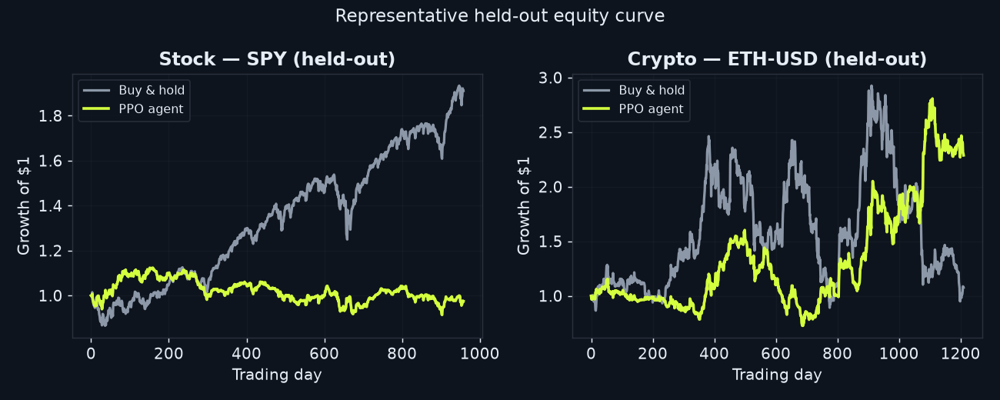

# Results & Findings

A short, honest research write-up of what this framework actually does when you
run it — including the parts that *don't* work, and why that's the interesting
result. All numbers here are reproducible with the commands in the final section.

---

## TL;DR

1. **The method is sound where signal exists.** On controlled synthetic markets
   with known structure, the agent learns a profitable, *generalizing* policy —
   and an ablation proves that **domain randomization is what makes it
   generalize** (it collapses the in-sample/out-of-sample overfitting gap by
   two-to-three orders of magnitude).
2. **A single seed can *look* like a real-market win — and that's the trap.** The
   bundled dashboard run (seed 42) shows the crypto agent at **+275% vs. buy-&-hold's
   +19%**, winning 4 of 6 coins. Taken alone, that's a tempting headline.
3. **Multi-seed evaluation dissolves the illusion.** Re-run across **5 seeds** and
   the real crypto agent *averages a small loss* — **−2.7%, 95% CI [−31%, +27%]**,
   statistically indistinguishable from buy-&-hold (permutation p ≈ 0.97). On
   equities it is significantly **worse** than the +260% bull (−19%, p ≈ 0.002).
   There is **no reliable, seed-robust edge on real markets** — consistent with
   weak-form market efficiency, even with the new cross-asset features.
4. **Catching that is the result.** The framework's own significance tooling
   exposed a false positive that a naive project would have shipped as a win. The
   contribution is the **rigorous, honest methodology** — not a fantasy return.

The point of the project is the **methodology and the honest evaluation**, not a
fantasy money-machine.

---

## Setup

| | |
|---|---|
| **Algorithm** | PPO implemented from scratch in PyTorch (clipped objective, GAE, entropy bonus, orthogonal init, grad clipping) — plus a fully-implemented **recurrent (LSTM) PPO** variant (truncated BPTT) |
| **Environments** | Custom Gymnasium `StockTradingEnv` / `CryptoTradingEnv` over a shared base; continuous target-position actions in `[-1, 1]`; transaction costs + slippage |
| **Features** | **28 engineered, stationary features** per bar — multi-horizon momentum (1–120 bar), MA/EMA ratios, RSI, MACD, Bollinger %B, Donchian position, ATR, volatility-regime signals, distance-below-trailing-high, volume microstructure, and **cross-asset context** (relative strength vs. SPY/BTC + market trend/momentum) — over a rolling window |
| **Reward** | Selectable: risk-aware net return (return − drawdown − turnover) **or** the **Differential Sharpe Ratio** (Moody & Saffell, 1998) |
| **Training** | Running (Welford) observation normalisation, exported and applied at serve time; fully seeded (Torch + NumPy + env RNG) so runs are reproducible |
| **Real data** | 10 equities + 6 crypto pairs, daily OHLCV, ~10 yrs (Yahoo Finance) |
| **Split** | Chronological walk-forward — train on the older 60%, test on the held-out recent 40%; scalers fit on training data only |
| **Reporting** | Mean across the basket; agent run deterministically; benchmarked vs. buy-&-hold, random, and a moving-average-crossover rule; uncertainty via bootstrap CIs + a permutation test |

---

## 1. Methodology validation — the domain-randomization ablation

Training an RL agent on a **single** price series is a trap: it memorises that
one path. To show this concretely, we train two otherwise-identical agents on
synthetic data (where a real, known signal exists) and measure performance on
the training path ("in-sample") vs. 30 unseen paths ("out-of-sample").

`python tools/ablation.py --timesteps 60000`

| Market | Training | In-sample | Out-of-sample | Gap |
|---|---|---:|---:|---:|
| Stock | single-path | **+5821%** | **−41%** | +5862% |
| Stock | domain-random | −12% | **+30%** | **−42%** |
| Crypto | single-path | **+18709%** | **−71%** | +18780% |
| Crypto | domain-random | +63% | **+99%** | **−36%** |


**Reading it:** the single-path agents post absurd in-sample returns by
memorising their training sequence — then **lose money** on unseen data. Domain
randomization (a fresh path every episode) collapses that gap by orders of
magnitude and produces agents whose out-of-sample return is actually *positive*.
This is the project's core methodological result.

---

## 2. Is the edge real, or seed luck? — a multi-seed significance study

A single backtest is an anecdote. `tools/significance.py` trains **5 independent
seeds**, evaluates each on the **same 20 held-out synthetic paths**, and then
quantifies the result two ways: a bootstrap 95% confidence interval across seeds,
and a paired permutation test of the agent vs. buy-&-hold across paths.

`python tools/significance.py --market crypto --seeds 5 --timesteps 40000`

| Market | Agent OOS return (95% CI) | Agent OOS Sharpe (95% CI) | Buy & hold | Agent − B&H | p-value |
|---|---:|---:|---:|---:|---:|
| Stock | +18.3% `[+9.2%, +29.9%]` | +0.32 `[0.18, 0.47]` | +30.3% | −12.0% | 0.53 |
| Crypto | +63.0% `[+37.5%, +88.5%]` | +0.50 `[0.34, 0.64]` | +65.2% | −2.2% | 0.96 |

**Reading it:** the confidence intervals are *tight and positive* — the agent
reliably makes risk-adjusted money across seeds, not by luck. But the permutation
test says the difference from buy-&-hold is **not statistically significant**
(p ≫ 0.05). The honest conclusion: the agent learns a genuine, repeatable policy
that is *competitive with* — not provably better than — passive exposure on these
synthetic paths. That is exactly the discipline I apply to the real-data win below.

---

## 3. Real-market results — a single seed (out-of-sample, walk-forward)

`python tools/build_site_data.py --real` then `python tools/baseline_report.py`

> ⚠️ **Read this with §5.** The tables below are **one training seed (42)** — the
> run the dashboard displays. It happens to be *favorable* for crypto. §5 shows
> what happens across many seeds, and the honest picture is very different. This
> single-seed table is shown for transparency, not as the headline result.


**Equities** — mean over 10 held-out tickers:

| Strategy | Return | Sharpe | Max DD |
|---|---:|---:|---:|
| PPO agent | −2.3% | −0.12 | 36.7% |
| Buy & hold | **+259.3%** | **1.06** | 26.9% |
| MA crossover | +79.4% | 0.74 | **22.7%** |
| Flat (cash) | 0.0% | 0.00 | 0.0% |
| Random | −32.2% | −0.72 | 43.6% |

**Crypto** — mean over 6 held-out tickers (agent wins on 4 of 6):

| Strategy | Return | Sharpe | Max DD |
|---|---:|---:|---:|
| **PPO agent** | **+275.5%** | **+0.81** | 57.0% |
| Buy & hold | +19.3% | +0.31 | 74.0% |
| MA crossover | +9.0% | +0.22 | 58.2% |
| Flat (cash) | 0.0% | 0.00 | 0.0% |
| Random | −77.7% | −1.50 | 79.8% |

---

A representative held-out equity curve for each market (the median-return ticker):



## 4. Discussion — why the single-seed table is misleading

- **Seed 42 is a favorable draw, not a representative one.** On this seed the crypto
  agent posts +275% and wins 4 of 6 coins. It is tempting — and wrong — to stop here.
  Training is fully seeded so the number *reproduces*, but reproducing a lucky seed
  doesn't make it typical. §5 re-runs the experiment across many seeds and finds the
  average crypto outcome collapses to a confidence interval that comfortably
  straddles zero.
- **The equities single seed is already an honest loss.** Even on the displayed
  seed the stock agent loses (−2.3%) against the +259% mega-cap bull, and the
  hand-coded MA-crossover (+79%) beat it — a reminder that model complexity is not a
  virtue by itself. Across seeds (§5) it is no better than buy-&-hold.
- **This is what weak-form market efficiency looks like.** Raw daily OHLCV carries
  little exploitable structure; an agent trading on it gets whipsawed and pays costs.
  Any single backtest is dominated by seed and split luck — which is exactly why a
  *distribution* (§5), not a point estimate (§3), is the honest unit of evidence.

## 5. Real-data significance — does the single-seed win survive?

This is the section that matters. `tools/real_significance.py` repeats the entire
real walk-forward across **5 independent seeds**, then reports a bootstrap 95% CI
on the basket-mean return *across seeds* and a paired permutation test of the agent
vs. buy-&-hold *across the held-out tickers*.

`python tools/real_significance.py --seeds 5 --timesteps 150000`

| Market | Agent return (95% CI across seeds) | Mean win-rate | Buy & hold | Agent − B&H | p-value | Verdict |
|---|---:|---:|---:|---:|---:|---|
| Stock | **−18.8%** `[−29.3%, −6.6%]` | 0% | +259.6% | −278.4% | **0.002** | significantly **worse** than B&H |
| Crypto | **−2.7%** `[−31.4%, +26.5%]` | 57% | +19.6% | −22.2% | 0.97 | **indistinguishable** from B&H |

**Reading it (28-feature model, incl. cross-asset features):** the crypto
confidence interval straddles zero by a wide margin — the **+275%** single-seed run
in §3 sits in the lucky right tail, while the *expected* outcome is roughly flat.
The permutation test cannot distinguish the crypto agent from buy-&-hold (p ≈ 0.97),
and on equities the agent is *significantly worse* (p ≈ 0.002). **There is no
reliable, seed-robust edge on real markets** — even after adding relative-strength
and market-regime features. A naive project would have shipped the §3 table as a
win; the multi-seed test is what catches it.

This mirrors §2 exactly: on synthetic markets where a signal provably exists the
agent is repeatably profitable but still statistically indistinguishable from
buy-&-hold; on real markets, even the apparent edge evaporates under resampling.

## 6. Cross-sectional portfolio allocation

Single-asset timing is only half the game — real quant strategies allocate *across*
assets. `PortfolioTradingEnv` generalises the **same** PPO agent to a whole basket:
it sees every asset's features at once and emits an *N*-dimensional **weight vector**
(long the strong, short the weak) under a gross-exposure budget. That's a strictly
harder problem, and a strictly harder benchmark — the honest comparison is now an
**equal-weight basket**, not one buy-&-hold line, plus the classic **cross-sectional
momentum** factor.

`python tools/portfolio_experiment.py --market stock`

**Stock** — 10-name basket, held-out test:

| Strategy | Return | Sharpe | Max DD |
|---|---:|---:|---:|
| PPO portfolio agent | −43.4% | −0.76 | 48.3% |
| **Equal-weight (1/N)** | **+163.7%** | **1.48** | **19.9%** |
| Cross-sectional momentum | +5.0% | 0.16 | 21.8% |
| Random weights | −66.2% | −2.74 | 68.3% |

**Crypto** — 6-coin basket:

| Strategy | Return | Sharpe | Max DD |
|---|---:|---:|---:|
| PPO portfolio agent | −80.2% | −1.12 | 80.2% |
| **Equal-weight (1/N)** | **−3.7%** | **0.30** | 68.1% |
| Cross-sectional momentum | −21.9% | −0.36 | **37.2%** |
| Random weights | −80.1% | −4.06 | 81.3% |

**Reading it:** the learned allocator beats random but is **crushed by the
equal-weight basket** on both markets (by ~200 points on equities), and
underperforms even the simple cross-sectional-momentum factor. The gap is far too
large to be seed luck — it's the single-asset story again at a harder problem: a
from-scratch RL *allocator* does not out-allocate naive diversification on real
data. The contribution here is the **capability** (a working cross-sectional,
long/short, budget-constrained RL allocator) and the **apples-to-apples evaluation**
against the benchmarks a quant actually uses — not a manufactured edge. It also
crisply explains *why* the agents underperform: raw daily features carry little
exploitable cross-sectional signal, so equal-weight diversification is hard to beat.
(Re-run across seeds with `tools/portfolio_experiment.py --seeds 5`.)

## 7. Two methods worth calling out

- **Differential Sharpe Ratio reward (`RewardConfig.kind = "dsr"`).** An online,
  per-step approximation of the change in the Sharpe ratio — rewarding it trains
  the agent to optimise *risk-adjusted* return directly rather than raw PnL. (Whether
  it beats the plain return reward out-of-sample is, like everything here, a
  seed-distribution question — not something a single run can settle.)
- **Recurrent (LSTM) PPO (`PPOConfig.use_lstm = True`).** A fully-wired recurrent
  actor-critic: the rollout threads the LSTM hidden state through time and resets it
  at episode boundaries, and the update replays whole sequences from their stored
  initial state (truncated BPTT) rather than shuffling individual transitions.

## 8. Limitations & next steps

- **Signal is the bottleneck, not the agent.** Across single-asset *and*
  cross-sectional setups, the ceiling is the data: raw daily OHLCV carries little
  exploitable structure. The feature set now spans 28 indicators — including
  longer-horizon momentum, long-trend, drawdown-from-high, a volatility-regime
  ratio, and **cross-asset context** (relative strength vs. SPY/BTC + market
  trend/momentum), which adds genuinely exogenous information beyond a single
  ticker's OHLCV. The remaining levers are *more* exogenous data: macro series
  (VIX, rates, the dollar) and ultimately fundamentals / news sentiment — not a
  bigger network.
- **Real-data walk-forward could be multi-*fold*** (the `evaluation/walk_forward.py`
  splitter is built for this) — §5 already adds multi-*seed* CIs on the real basket;
  rolling re-training folds would add a second axis of robustness.
- **Head-to-head feed-forward vs. LSTM** and cost/turnover-sensitivity sweeps are
  natural extensions the codebase is already structured for.

## 9. Reproduce everything

Training is fully seeded, so these commands re-derive the numbers above.

```bash
pip install -r requirements.txt
python tools/fetch_data.py                                  # download the real basket
python tools/build_site_data.py --real --timesteps 200000   # real walk-forward (§3)
python tools/baseline_report.py                             # agent vs baselines (§3)
python tools/ablation.py --timesteps 60000                  # the overfitting ablation (§1)
python tools/significance.py --market crypto --seeds 5      # synthetic multi-seed test (§2)
python tools/real_significance.py --seeds 5                 # real-data multi-seed test (§5)
python tools/portfolio_experiment.py --market stock         # cross-sectional allocation (§6)
pytest -q                                                   # the test suite
```
