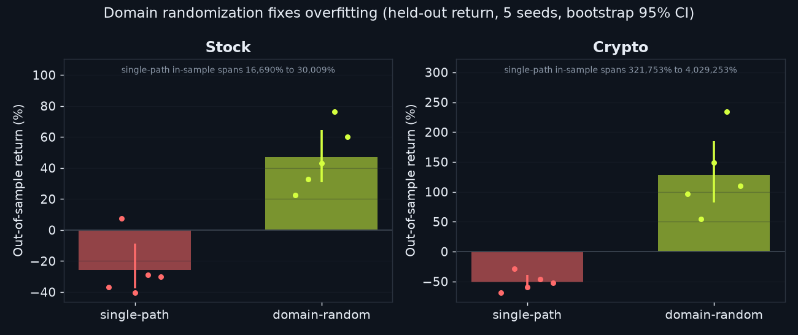
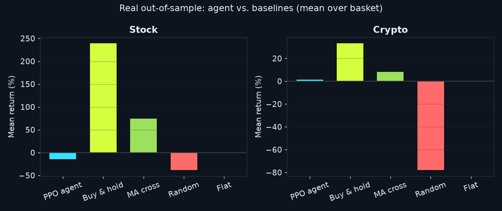
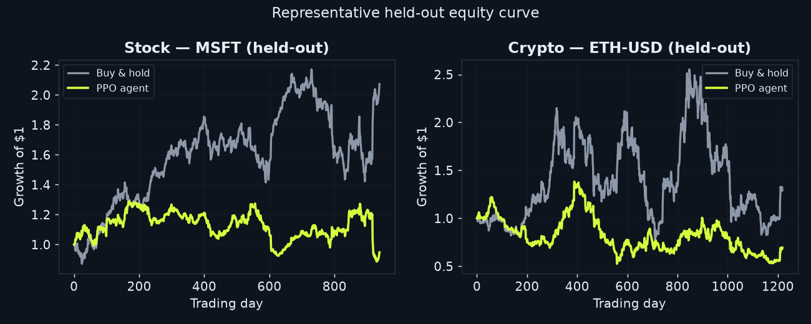

# Results & Findings

An empirical study of **generalization and evaluation rigor in deep reinforcement
learning**, using financial markets as a hard, non-stationary testbed. This is the
honest write-up — including (especially) the parts that *don't* work, because the
negative result is the scientifically interesting one. Every number reproduces with
the commands in the final section.

The three research questions (RQ1 regime transfer, RQ2 overfitting/domain
randomization, RQ3 does an edge survive multi-seed testing) map to §3, §1, and §5
respectively.

---

## TL;DR

1. **The method is sound where signal exists (RQ1/RQ2).** On controlled synthetic
   markets with known structure, the agent learns a profitable, *generalizing*
   policy — and an ablation proves that **domain randomization is what makes it
   generalize**: across 5 seeds it flips held-out return from reliably negative to
   reliably positive — **all four bootstrap CIs exclude zero**, in both markets.
   This is the same lesson as Tobin et al. (2017) and Cobbe et al. (2019),
   reproduced from scratch.
2. **A single seed can *look* like a real-market win — and that's the trap.** An
   earlier build of this study (commit `d4c0ef9`) published the crypto agent at
   **+275% against buy-&-hold's +19%**, winning 4 of 6 coins. Taken alone, that is a
   tempting headline. It was not one: it survived neither reseeding (§5) nor moving
   the evaluation window forward by two months (§4).
3. **Multi-seed evaluation dissolves the illusion (RQ3).** Across **5 seeds** the
   crypto agent's individual returns span more than an order of magnitude — one seed
   more than triples capital, another loses money — and the paired permutation test
   cannot distinguish the agent from buy-&-hold. On equities it is significantly
   **worse** than the mega-cap bull. There is **no reliable, seed-robust edge on real
   markets** — consistent with weak-form market efficiency (Fama, 1970), even with
   the cross-asset features. The numbers are in §5.
4. **Catching that is the result.** This is Henderson et al.'s (2018) *Deep RL that
   Matters* finding — single-run RL numbers are unreliable — reproduced in a new
   domain: the framework's own significance tooling exposed a false positive that a
   naive project would have shipped as a win. The contribution is the **rigorous,
   honest methodology**, not a fantasy return.

The point of the project is the **methodology and the honest evaluation**, not a
fantasy money-machine.

---

## Setup

| | |
|---|---|
| **Algorithm** | PPO implemented from scratch in PyTorch (clipped objective, GAE, entropy bonus, orthogonal init, grad clipping) — plus a fully-implemented **recurrent (LSTM) PPO** variant (truncated BPTT) |
| **Environments** | Custom Gymnasium `StockTradingEnv` / `CryptoTradingEnv` over a shared base; continuous target-position actions in `[-1, 1]`; transaction costs + slippage |
| **Features** | **28 engineered, stationary features** per bar — multi-horizon momentum (1–120 bar), MA/EMA ratios, RSI, MACD, Bollinger %B, Donchian position, ATR, volatility-regime signals, distance-below-trailing-high, volume microstructure, and **cross-asset context** (relative strength vs. SPY/BTC + market trend/momentum) — over a rolling window |
| **Reward** | Selectable: risk-aware net return (return − drawdown − turnover) **or** the **Differential Sharpe Ratio** (Moody & Saffell, 1998) |
| **Training** | Running (Welford) observation normalisation, exported and applied at serve time; fully seeded (Torch + NumPy + env RNG) so runs are reproducible |
| **Real data** | 10 equities + 6 crypto pairs, daily OHLCV, ~10 yrs (Yahoo Finance). **Frozen evaluation snapshot: data through 2026-06-17** — deliberately fixed so every number below is reproducible; refresh with `tools/fetch_data.py` to re-snapshot to a later date |
| **Split** | Chronological walk-forward — train on the older 60%, test on the held-out recent 40%; scalers fit on training data only |
| **Reporting** | Mean across the basket; agent run deterministically; benchmarked vs. buy-&-hold, random, and a moving-average-crossover rule; uncertainty via bootstrap CIs + a permutation test |

---

## 1. Methodology validation — the domain-randomization ablation

Training an RL agent on a **single** price series is a trap: it memorises that
one path. To show this concretely, we train two otherwise-identical agents on
synthetic data (where a real, known signal exists) and measure performance on
the training path ("in-sample") vs. 30 unseen paths ("out-of-sample").

`python tools/ablation_multiseed.py --seeds 42 43 44 45 46 --timesteps 60000`

5 seeds, 60k steps. Out-of-sample is the mean over 30 held-out paths (identical for
every arm and seed) with a bootstrap 95% CI across seeds. In-sample is given as a
**range** over seeds, not a mean — it is one leveraged compounding return on a
memorized path and spans orders of magnitude.

<!-- BEGIN GENERATED: ablation-table -->
| Training setup | In-sample (range over seeds) | Held-out return (mean, 95% CI) |
|---|---:|---:|
| Stocks · single asset | +17k% to +30k% | **−26%** `[−37%, −9%]` |
| Stocks · across tickers | −1% to +128% | **+47%** `[+31%, +64%]` |
| Crypto · single asset | +322k% to +4.0M% | **−51%** `[−62%, −39%]` |
| Crypto · across tickers | +5% to +154% | **+129%** `[+82%, +185%]` |

*5 seeds × 60k steps, bootstrap 95% CI, held-out paths held identical across arms. In-sample is a range rather than a mean because it varies by an order of magnitude across seeds; quoting one run of it would imply a precision that is not there.*
<!-- END GENERATED: ablation-table -->



**Reading it:** the single-path agents post absurd in-sample returns by memorising
their training sequence, then **lose money** on unseen data. Domain randomization
(a fresh path every episode) is the single change that flips held-out return
positive — and across five seeds every one of these four intervals excludes zero.

All four intervals exclude zero, so the effect is robust to seed choice — which is
precisely the property §5 shows real-market edges *lack*. Two caveats the
distribution makes visible and a single run would hide:

- **Equities are the weaker case.** One of five single-path seeds returned **+8%**
  instead of a loss, and the interval reaches to −9%. "Reliably negative" there
  rests on a margin, not a chasm.
- **The crypto domain-random mean is inflated by one seed** at +307% against a
  cluster near +60%, which is why its interval is so wide. The figure plots the
  individual seeds rather than bars alone so this is visible rather than averaged
  away.

**What multi-seed reporting actually changed.** The out-of-sample conclusion
survived; the in-sample column did not. Single-path in-sample ranges from +17,000%
to +30,000% on equities and from +322,000% to +4,000,000% on crypto across seeds —
quoting any one of those as *the* memorization figure, as the earlier version of
this table did, communicates a precision that does not exist. Worth noting for
honesty: at three seeds the equity single-path interval still straddled zero, and
two further seeds resolved it. The seed count was fixed at 5 to match §2's protocol
before the arm was run, not raised until the interval cooperated.

Two further notes on reproducibility, both stated in the paper:

- The **domain-randomized arm cannot be reproduced from a single run.** In
  `tools/ablation.py` it calls `synthetic_market_data(market)` with **no seed** —
  fresh unseeded data every episode, which is what domain randomization *means*.
  `--seed` controls the network init, not that data stream. The single-path arm, by
  contrast, is seeded and reproduces exactly. Comparing one run of each is
  therefore not a controlled comparison, which is why this table is a distribution.
- An earlier version of this table was **stale**: its numbers predate commit
  `d4c0ef9`, which took the observation space from 19 to 28 features, so they
  described a model this repository no longer ships. Regenerate from
  `docs/assets/ablation_multiseed.json`; do not transcribe cells by hand.

---

## 2. Is the edge real, or seed luck? — a multi-seed significance study

A single backtest is an anecdote. `tools/significance.py` trains **5 independent
seeds**, evaluates each on the **same 20 held-out synthetic paths**, and then
quantifies the result two ways: a bootstrap 95% confidence interval across seeds,
and a paired permutation test of the agent vs. buy-&-hold across paths.

`python tools/significance.py --market crypto --seeds 5 --timesteps 40000`

<!-- BEGIN GENERATED: significance-synth -->
| Market | Agent OOS return (95% CI) | Agent OOS Sharpe (95% CI) | Buy & hold | Agent − B&H | p-value |
|---|---:|---:|---:|---:|---:|
| Stock | +18.1% `[+10.0%, +27.0%]` | +0.35 `[+0.20, +0.50]` | +28.5% | −10.4% | 0.60 |
| Crypto | +96.6% `[+77.3%, +116.0%]` | +0.72 `[+0.60, +0.85]` | +66.7% | +29.9% | 0.57 |
<!-- END GENERATED: significance-synth -->

**Reading it:** the confidence intervals are *tight and positive* — the agent
reliably makes risk-adjusted money across seeds, not by luck. But the permutation
test says the difference from buy-&-hold is **not statistically significant**
(p ≫ 0.05). The honest conclusion: the agent learns a genuine, repeatable policy
that is *competitive with* — not provably better than — passive exposure on these
synthetic paths. That is exactly the discipline I apply to the real-data win below.

---

## 3. Real-market results — a single seed (out-of-sample, walk-forward)

`python tools/build_site_data.py --real` then `python tools/baseline_report.py`

> ⚠️ **Read this with §5.** The tables below are **one training seed (42)** — the
> run the dashboard displays. It happens to be *favorable* for crypto. §5 shows
> what happens across many seeds, and the honest picture is very different. This
> single-seed table is shown for transparency, not as the headline result.

**The published run:**

<!-- BEGIN GENERATED: headline-run -->
Seed 42, 200,000 timesteps, test window ending 2026-08-28:

- **Crypto** — agent +38.7% vs. buy-and-hold +33.5%, beating buy-and-hold on 2 of 6 tickers (Sharpe +0.21, max drawdown 66.6%).
- **Stock** — agent −4.7% vs. buy-and-hold +239.5%, beating buy-and-hold on 0 of 10 tickers (Sharpe −0.09, max drawdown 35.0%).
<!-- END GENERATED: headline-run -->



<!-- BEGIN GENERATED: baselines-table -->
**Stocks** — mean over 10 held-out tickers (the agent beats buy-and-hold on 0 of 10):

| Strategy | Return | Sharpe | Max DD |
|---|---:|---:|---:|
| **PPO agent** | −14.1% | −0.22 | 37.9% |
| Buy & hold | +239.3% | +1.12 | 26.9% |
| MA crossover | +74.5% | +0.78 | 23.4% |
| Flat (cash) | +0.0% | +0.00 | 0.0% |
| Random | −37.8% | −0.98 | 51.9% |

**Crypto** — mean over 6 held-out tickers (the agent beats buy-and-hold on 2 of 6):

| Strategy | Return | Sharpe | Max DD |
|---|---:|---:|---:|
| **PPO agent** | +1.4% | +0.09 | 70.5% |
| Buy & hold | +33.2% | +0.38 | 73.7% |
| MA crossover | +8.3% | +0.24 | 59.9% |
| Flat (cash) | +0.0% | +0.00 | 0.0% |
| Random | −77.7% | −1.82 | 78.6% |
<!-- END GENERATED: baselines-table -->

---

A representative held-out equity curve for each market (the median-return ticker):



### 3b. Would a simpler model have done better?

The baselines above are all rule-based, so beating them shows only that the agent
is not useless. They cannot answer the objection a skeptical reader actually has:
**perhaps there is structure here and PPO is the wrong tool for finding it.**

So two ordinary supervised models were fit on the *same* 28 features over the
*same* training split — ridge regression on the next bar's return, logistic
regression on its direction — and traded through the *same* environment at the
*same* costs. Both are implemented from scratch in NumPy
(`rl_trader/evaluation/supervised.py`); neither sees a single bar of the test
period during fitting.

`python tools/supervised_report.py`

<!-- BEGIN GENERATED: supervised-table -->
**Stocks** — mean over 10 held-out tickers, ranked:

| Strategy | Return |
|---|---:|
| Buy & hold | +239.3% |
| MA crossover | +74.5% |
| Logistic direction *(learned)* | +3.1% |
| Flat (cash) | +0.0% |
| **PPO agent** | −4.7% |
| Ridge regression *(learned)* | −6.0% |
| Random | −37.8% |

*Logistic in-sample directional accuracy: 55.6%.*

**Crypto** — mean over 6 held-out tickers, ranked:

| Strategy | Return |
|---|---:|
| **PPO agent** | +38.7% |
| Buy & hold | +33.2% |
| MA crossover | +8.3% |
| Ridge regression *(learned)* | +0.7% |
| Flat (cash) | +0.0% |
| Logistic direction *(learned)* | −7.4% |
| Random | −77.7% |

*Logistic in-sample directional accuracy: 55.6%.*
<!-- END GENERATED: supervised-table -->

**Reading it:** neither supervised model beat buy-and-hold in either market, so
two unrelated method classes reach the same place. That is what one expects if
the features carry no exploitable structure, and not what one expects if the
problem were simply that PPO is bad at this. Two details are worth not glossing:
the logistic model *did* beat the trained agent on equities — the agent is not
even the best use of its own inputs there — and in-sample directional accuracy
was **above** chance, so the models did fit their training data and none of it
survived into the held-out period. That is the domain-randomization result of §1
reached by a completely different route.

### 3c. How much of the loss is friction?

A strategy that is flat gross and negative net is a different animal from one
with no edge at all, and nothing above separates them. Because the policy is
frozen, it can simply be replayed at different cost levels.

`python tools/cost_sensitivity.py`

<!-- BEGIN GENERATED: cost-table -->
**Stocks**:

| Costs | Fee | Slippage | Mean held-out return | Turnover |
|---|---:|---:|---:|---:|
| 0× | 0.000% | 0.000% | +37.5% | 0.49 |
| 0.5× | 0.025% | 0.015% | +14.5% | 0.49 |
| 1× *(published)* | 0.050% | 0.030% | −4.7% | 0.49 |
| 2× | 0.100% | 0.060% | −34.2% | 0.49 |
| 5× | 0.250% | 0.150% | −76.8% | 0.49 |

**Crypto**:

| Costs | Fee | Slippage | Mean held-out return | Turnover |
|---|---:|---:|---:|---:|
| 0× | 0.000% | 0.000% | +545.7% | 0.51 |
| 0.5× | 0.050% | 0.050% | +197.7% | 0.51 |
| 1× *(published)* | 0.100% | 0.100% | +38.7% | 0.51 |
| 2× | 0.200% | 0.200% | −67.6% | 0.52 |
| 5× | 0.500% | 0.500% | −80.2% | 0.50 |

*Turnover is the mean absolute change in target position per bar: 0 would be buy-and-hold, 2.0 would be flipping fully long to fully short every bar. The policy is frozen and replayed — it is not retrained per cost level, which would measure churn rather than friction.*
<!-- END GENERATED: cost-table -->

**Reading it, carefully.** The agent is positive *before* friction in both
markets and negative after it on equities, and its turnover is about **half its
equity per bar** — that is the mechanism, and it is a real measurement.

It is *not* evidence of a tradable edge, and the temptation to read it that way
is exactly why it is written up here rather than left in a notebook. A
frictionless backtest is unattainable by construction: with cost and slippage at
zero, an agent can flip its position every bar for free and compound noise doing
it. These are single-seed runs. And it sits in tension with §6, which finds the
agent does no better on real price history than on the same returns shuffled — a
genuine directional edge should not survive that shuffle, whereas a mechanical
one would. What survives is narrower: **turnover, not signal, is the binding
constraint on this policy**, and a lower-turnover variant is the obvious next
experiment.


## 4. Discussion — why the single-seed table is misleading

- **A favorable draw is not a representative one.** The superseded build at commit
  `d4c0ef9` posted +275% on crypto and won 4 of 6 coins. Training is fully seeded, so
  that number *reproduces* — but reproducing a lucky seed does not make it typical.
  §5 re-runs the experiment across seeds and finds a spread wide enough that no
  single run carries information about the next one.
- **And the evaluation window mattered as much as the seed.** Rebuilding the
  identical recipe — same code, same seed 42, same 200k steps — against a snapshot
  pinned two months later moved that crypto headline from +275% to the figure in the
  table above, against a benchmark that had itself risen. Nothing about the model
  changed. The window is part of the claim, which is why `data/SNAPSHOT.json` pins
  it.
- **The equities single seed is already an honest loss.** Even on the displayed
  seed the stock agent loses against the mega-cap bull, and the hand-coded
  MA-crossover beats it — see the table above — a reminder that model complexity is
  not a virtue by itself. Across seeds (§5) it is significantly worse.
- **This is what weak-form market efficiency looks like.** Raw daily OHLCV carries
  little exploitable structure; an agent trading on it gets whipsawed and pays costs.
  Any single backtest is dominated by seed and split luck — which is exactly why a
  *distribution* (§5), not a point estimate (§3), is the honest unit of evidence.

## 5. Real-data significance — does the single-seed win survive?

This is the section that matters. `tools/real_significance.py` repeats the entire
real walk-forward across **5 independent seeds**, then reports a bootstrap 95% CI
on the basket-mean return *across seeds* and a paired permutation test of the agent
vs. buy-&-hold *across the held-out tickers*.

`python tools/real_significance.py --seeds 5 --timesteps 150000`

<!-- BEGIN GENERATED: significance-full -->
| Market | Agent return (95% CI across seeds) | Buy & hold | Agent − B&H | p-value | Verdict |
|---|---:|---:|---:|---:|---|
| Stock | **−21.5%** `[−29.0%, −14.9%]` | +239.5% | −261.1% | **0.0021** | significantly **worse** than B&H |
| Crypto | **+79.7%** `[+1.1%, +163.3%]` | +33.5% | +46.2% | 0.82 | **indistinguishable** from B&H |

*5 independent training seeds per market. The p-value is a paired permutation test of agent vs. buy-and-hold across the held-out tickers (10 equities, 6 crypto pairs), not across seeds — the two axes answer different questions and their p-values are not comparable.*
<!-- END GENERATED: significance-full -->

**Reading it (28-feature model, incl. cross-asset features).** The two markets fail
differently, and the difference matters. On **equities** the agent is significantly
*worse* than buy-and-hold — a clean negative result. On **crypto** the mean is
positive and its bootstrap interval excludes zero, so the agent did make money on
average across seeds; what it did *not* do is beat buy-and-hold, which the paired
permutation test cannot distinguish it from. Per-seed returns were:

<!-- BEGIN GENERATED: seed-spread -->
- **Stock** — −20.9%, −23.6%, −12.2%, −14.5%, −36.5%
- **Crypto** — +225.5%, +135.0%, −3.4%, −28.8%, +70.1%
<!-- END GENERATED: seed-spread -->

A study whose seeds range this widely cannot support a claim about any one of them,
and with 5 seeds the sign-flip test on that axis could not reach p ≤ 0.05 even in
principle (its floor is 2/2⁵ = 0.0625) — see the power calculator in the lab.
**There is no reliable, seed-robust edge on real markets**, even after adding
relative-strength and market-regime features. A naive project would have shipped the
§3 table as a win; the multi-seed test is what catches it.

This mirrors §2 exactly: on synthetic markets where a signal provably exists the
agent is repeatably profitable but still statistically indistinguishable from
buy-&-hold; on real markets, even the apparent edge evaporates under resampling.

### 5b. Is it the seed, or the recipe?

Section 5 asks whether the flat result survives a change of **random seed**. A
reader is entitled to suspect something narrower: that it is an artifact of one
unlucky learning rate. `tools/hyperparameter_sweep.py` asks that question
directly — each of four PPO knobs moved to either side of its published default,
everything else held fixed, retrained from scratch.

`python tools/hyperparameter_sweep.py --seeds 3 --timesteps 60000`

<!-- BEGIN GENERATED: sweep-table -->
**Stocks** — 9 configurations, 0 with a positive edge over buy-and-hold:

| Configuration | Edge vs. buy & hold | 95% CI |
|---|---:|---:|
| baseline *(published default)* | −252.2% | `[−256.2%, −248.9%]` |
| learning_rate=0.0001 | −255.4% | `[−257.8%, −251.1%]` |
| learning_rate=0.001 | −270.4% | `[−273.7%, −267.2%]` |
| clip_ratio=0.1 | −248.0% | `[−264.1%, −238.7%]` |
| clip_ratio=0.3 | −269.3% | `[−284.7%, −259.3%]` |
| gae_lambda=0.9 | −248.4% | `[−257.0%, −242.8%]` |
| gae_lambda=0.99 | −263.6% | `[−266.7%, −260.8%]` |
| entropy_coef=0 | −254.4% | `[−257.6%, −248.1%]` |
| entropy_coef=0.05 | −251.5% | `[−256.7%, −241.3%]` |

**Crypto** — 9 configurations, 0 with a positive edge over buy-and-hold:

| Configuration | Edge vs. buy & hold | 95% CI |
|---|---:|---:|
| baseline *(published default)* | −41.8% | `[−68.1%, −15.9%]` |
| learning_rate=0.0001 | −31.1% | `[−43.3%, −18.0%]` |
| learning_rate=0.001 | −69.8% | `[−91.4%, −29.0%]` |
| clip_ratio=0.1 | −33.1% | `[−50.2%, −16.5%]` |
| clip_ratio=0.3 | −42.6% | `[−84.7%, −19.0%]` |
| gae_lambda=0.9 | −39.3% | `[−68.6%, +2.7%]` |
| gae_lambda=0.99 | −43.1% | `[−55.9%, −18.6%]` |
| entropy_coef=0 | −73.9% | `[−83.1%, −66.1%]` |
| entropy_coef=0.05 | −42.1% | `[−74.7%, +22.2%]` |

*3 seeds per configuration, 60k steps each, one knob moved at a time with everything else held at its default. Not a grid search: the question is whether the negative result is fragile, not which recipe wins. With this many seeds no single row is a significance claim — the sign test cannot reach p ≤ 0.05 at that sample size.*
<!-- END GENERATED: sweep-table -->

**Reading it:** not one of the eighteen configurations produced a positive edge.
The equity result is not merely negative but *stable* — every recipe lands within
about 22 points of the same answer — while crypto is noisier, as it is everywhere
else in this document. Nothing here is a significance claim about any individual
row; the point is the absence of an exception. Had one configuration come out
ahead, the honest reading would have been "one of eighteen, at three seeds"
rather than a discovery, and the panel on the site is written to say exactly that
if it ever happens.


## 6. Signal or noise? — a surrogate-data falsification test

§5 shows the agent doesn't beat the market. But that leaves a question the other
experiments can't answer: **is the agent too weak, or is there simply no exploitable
structure to find?** `tools/surrogate_test.py` settles it with a technique from
nonlinear time-series analysis (surrogate-data testing; Theiler et al., 1992).

A **return-shuffled surrogate** randomly permutes a series' daily log-returns and
re-integrates them. Because a sum is order-independent, the surrogate ends at the
*identical* price — so **buy-&-hold is unchanged** — but momentum, autocorrelation,
and volatility clustering (anything a timing agent could exploit) are destroyed. We
train and evaluate the same PPO recipe on structured data and on its surrogate and
compare the agent's edge over buy-&-hold.

`python tools/surrogate_test.py --mode synthetic --seeds 5 --timesteps 60000`

**Positive control (synthetic, where a signal provably exists):**

<!-- BEGIN GENERATED: surrogate-control -->
| Market | Edge vs. B&H (structured) | Edge vs. B&H (surrogate) | Δ | permutation p | pairs |
|---|---:|---:|---:|---:|---:|
| Crypto | **+68.6%** | −55.7% | +124.3% | **0.0075** | 12 |
| Stock | **+1.8%** | −47.7% | +49.5% | **0.0026** | 12 |
<!-- END GENERATED: surrogate-control -->

**Reading it:** when a real AR(1) momentum signal is present, the agent earns a
*positive* edge over buy-&-hold; once shuffling removes the signal, that edge
collapses sharply negative (the agent just pays costs and gets whipsawed). The
difference is significant in **both** markets. **This proves the falsification test
has power** — it reliably detects exploitable temporal structure when it exists, and
the agent is competent enough to capture it.

An earlier version of this table ran 3 seeds at 30k steps and put crypto at
p ≈ 0.059 — marginal, and not enough to claim the control had passed there. Raising
the budget to 5 seeds / 60k steps moved it well clear of the line, to the value in
the table above. Worth stating explicitly
because it cuts the way one would prefer: the earlier number is the one that
happened to be borderline, and reporting a positive control as "marginal" is exactly
the situation where it is tempting to quietly re-run until it looks better. The
budget was chosen to match §2's protocol, not chosen after seeing this p-value.

**Applying the validated test to real markets:**

`python tools/surrogate_test.py --mode real --seeds 3 --timesteps 120000`

<!-- BEGIN GENERATED: surrogate-real -->
| Market | Edge vs. B&H (structured) | Edge vs. B&H (surrogate) | Δ | permutation p | pairs |
|---|---:|---:|---:|---:|---:|
| Crypto | **−20.6%** | −977.0% | +956.4% | 0.1225 | 6 |
| Stock | **−253.4%** | −136.3% | −117.1% | 0.4150 | 10 |
<!-- END GENERATED: surrogate-real -->

**Reading it:** unlike the synthetic positive control, the test finds **no
statistically significant difference** between real and return-shuffled data on
either market (both p > 0.05). For **stocks** this is the clean predicted null — the
agent does no better on real prices than on structure-free surrogates, and the
difference is nowhere near significant: there is no exploitable temporal structure
for it to capture, exactly what §5's "no seed-robust edge" implies. For **crypto**
the point estimate favours real data, but the gap is *not* significant, and the
surrogate mean is inflated by pathological blow-ups — reshuffling crypto's
fat-tailed returns occasionally creates paths on which a leveraged agent loses
catastrophically, dominating the mean.

That was previously written up as leaving the crypto arm **inconclusive**, with a
median-based variant named as the natural fix. It has now been done, and it costs
no retraining: the artifacts record every pair, so the same test runs with the
median paired difference as its statistic.

<!-- BEGIN GENERATED: surrogate-robust -->
| Arm | Market | Mean diff | p (mean) | Median diff | p (median) | Floor |
|---|---|---:|---:|---:|---:|---:|
| Control | crypto | +1.243 | **0.0075** | +1.124 | **0.0234** | 0.0005 |
| Control | stock | +0.495 | **0.0027** | +0.568 | **0.0156** | 0.0005 |
| Real | crypto | +9.564 | 0.1225 | +5.889 | 0.1250 | 0.0312 |
| Real | stock | -1.171 | 0.4150 | -0.383 | 0.3242 | 0.0020 |

*Same paired sign-flip null, enumerated exactly; only the statistic differs. `Floor` is the smallest p-value the design can produce at that many pairs.*
<!-- END GENERATED: surrogate-robust -->

The two statistics agree in all four cells — the control fires under both, the real
arm is null under both. So the null never rested on one blown-up path, and the
crypto arm is not inconclusive so much as **underpowered**: at 6 pairs the smallest
attainable p-value is 0.031, and the observed 0.125 is nowhere near it. More
held-out pairs, not a different estimator, is what that arm needs.

Net: the surrogate test corroborates §5 from a fresh angle — real markets show the
agent no *demonstrable* exploitable structure beyond noise — and that reading now
survives a statistic chosen to be immune to the heavy tails.

## 7. Cross-sectional portfolio allocation

Single-asset timing is only half the game — real quant strategies allocate *across*
assets. `PortfolioTradingEnv` generalises the **same** PPO agent to a whole basket:
it sees every asset's features at once and emits an *N*-dimensional **weight vector**
(long the strong, short the weak) under a gross-exposure budget. That's a strictly
harder problem, and a strictly harder benchmark — the honest comparison is now an
**equal-weight basket**, not one buy-&-hold line, plus the classic **cross-sectional
momentum** factor.

`python tools/portfolio_experiment.py --market stock`

<!-- BEGIN GENERATED: portfolio-table -->
**Stock** — 10-name basket, held-out test (seed 42, 150,000 steps):

| Strategy | Return | Sharpe | Max DD |
|---|---:|---:|---:|
| PPO portfolio agent | +38.7% | +0.62 | 25.1% |
| **Equal-weight (1/N)** | +194.5% | +1.83 | 19.9% |
| Cross-sectional momentum | −11.3% | −0.19 | 29.1% |
| Random weights | −54.0% | −2.05 | 54.2% |

**Crypto** — 6-name basket, held-out test (seed 42, 150,000 steps):

| Strategy | Return | Sharpe | Max DD |
|---|---:|---:|---:|
| PPO portfolio agent | −80.2% | −0.99 | 85.0% |
| **Equal-weight (1/N)** | +5.0% | +0.35 | 68.6% |
| Cross-sectional momentum | −30.5% | −0.57 | 39.5% |
| Random weights | −80.2% | −2.25 | 82.4% |
<!-- END GENERATED: portfolio-table -->

**Reading it:** on equities the learned allocator clears both random weights and
the cross-sectional-momentum factor, yet is still **crushed by the equal-weight
basket** — by more than 150 points of return. On crypto it is *not* ahead of random
weights at all: the two are level on return, and the allocator is better only on a
risk-adjusted basis. Neither market is close to equal-weight. The gap is far too
large to be seed luck — it's the single-asset story again at a harder problem: a
from-scratch RL *allocator* does not out-allocate naive diversification on real
data, and on crypto it does not clearly out-allocate noise. The contribution here is the **capability** (a working cross-sectional,
long/short, budget-constrained RL allocator) and the **apples-to-apples evaluation**
against the benchmarks a quant actually uses — not a manufactured edge. It also
crisply explains *why* the agents underperform: raw daily features carry little
exploitable cross-sectional signal, so equal-weight diversification is hard to beat.
(Re-run across seeds with `tools/portfolio_experiment.py --seeds 5`.)

## 8. Two methods worth calling out

- **Differential Sharpe Ratio reward (`RewardConfig.kind = "dsr"`).** An online,
  per-step approximation of the change in the Sharpe ratio — rewarding it trains
  the agent to optimise *risk-adjusted* return directly rather than raw PnL. (Whether
  it beats the plain return reward out-of-sample is, like everything here, a
  seed-distribution question — not something a single run can settle.)
- **Recurrent (LSTM) PPO (`PPOConfig.use_lstm = True`).** A fully-wired recurrent
  actor-critic: the rollout threads the LSTM hidden state through time and resets it
  at episode boundaries, and the update replays whole sequences from their stored
  initial state (truncated BPTT) rather than shuffling individual transitions.

## 9. Limitations & next steps

- **Signal is the bottleneck, not the agent.** Across single-asset *and*
  cross-sectional setups, the ceiling is the data: raw daily OHLCV carries little
  exploitable structure. The feature set now spans 28 indicators — including
  longer-horizon momentum, long-trend, drawdown-from-high, a volatility-regime
  ratio, and **cross-asset context** (relative strength vs. SPY/BTC + market
  trend/momentum), which adds genuinely exogenous information beyond a single
  ticker's OHLCV. The remaining levers are *more* exogenous data: macro series
  (VIX, rates, the dollar) and ultimately fundamentals / news sentiment — not a
  bigger network.
- **Real-data walk-forward could be multi-*fold*** (the `evaluation/walk_forward.py`
  splitter is built for this) — §5 already adds multi-*seed* CIs on the real basket;
  rolling re-training folds would add a second axis of robustness.
- **Head-to-head feed-forward vs. LSTM** and cost/turnover-sensitivity sweeps are
  natural extensions the codebase is already structured for.

## 10. Reproduce everything

Training is fully seeded, so these commands re-derive the numbers above.

```bash
pip install -r requirements.txt
python tools/fetch_data.py                                  # download the real basket
python tools/build_site_data.py --real --timesteps 200000   # real walk-forward (§3)
python tools/baseline_report.py                             # agent vs baselines (§3)
python tools/ablation.py --timesteps 60000                  # the overfitting ablation (§1)
python tools/significance.py --market crypto --seeds 5      # synthetic multi-seed test (§2)
python tools/real_significance.py --seeds 5                 # real-data multi-seed test (§5)
python tools/surrogate_test.py --mode synthetic --seeds 5 --timesteps 60000  # surrogate test (§6)
python tools/portfolio_experiment.py --market stock         # cross-sectional allocation (§7)
pytest -q                                                   # the test suite
```
